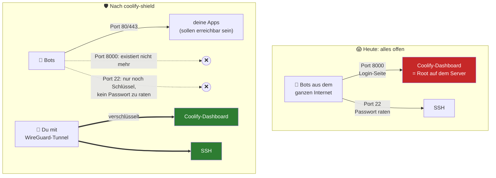
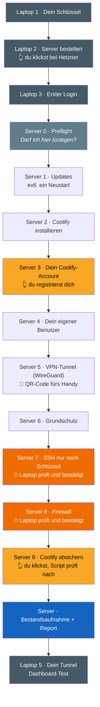
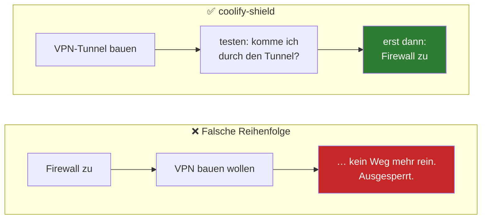
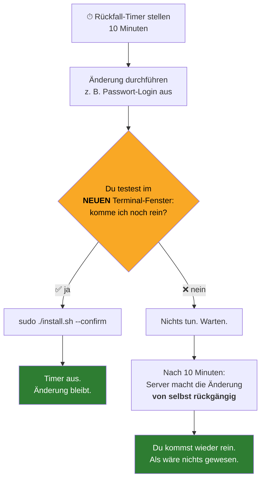
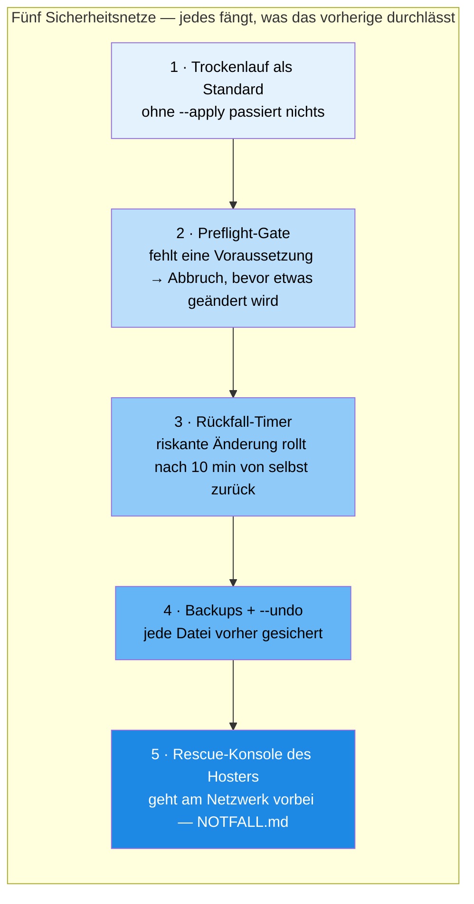

# coolify-shield für absolute Anfänger

> Du hast noch nie einen Server verwaltet, weißt nicht genau, was „SSH" oder „Firewall" bedeutet, und willst trotzdem Coolify, weil du deine eigenen Apps oder KI-Tools hosten willst? Oder du hast Coolify schon installiert und ein ungutes Gefühl dabei? **Dann ist diese Seite für dich.** Hier wird nichts vorausgesetzt. Alles wird einmal von Null erklärt: warum du das überhaupt brauchst, was das Script macht und wie es funktioniert.
>
> Im Kurs gibt es dazu ein Video. Diese Seite ist die Version zum Nachlesen — du kannst sie neben dem Terminal offen lassen.

---

## Inhaltsverzeichnis

1. [Die Kurzfassung in drei Sätzen](#1-die-kurzfassung-in-drei-sätzen)
2. [Was ist eigentlich ein Server?](#2-was-ist-eigentlich-ein-server)
3. [Was ist Coolify — und warum ist es gefährlich?](#3-was-ist-coolify--und-warum-ist-es-gefährlich)
4. [Wer greift dich überhaupt an?](#4-wer-greift-dich-überhaupt-an)
5. [Die Begriffe, die du brauchst](#5-die-begriffe-die-du-brauchst)
6. [Werkzeugkasten: Terminal und SSH — Schritt für Schritt](#6-werkzeugkasten-terminal-und-ssh--schritt-für-schritt)
7. [Was das Script macht — Schritt für Schritt erklärt](#7-was-das-script-macht--schritt-für-schritt-erklärt)
8. [Der Rückfall-Timer — warum du dich nicht aussperren kannst](#8-der-rückfall-timer--warum-du-dich-nicht-aussperren-kannst)
9. [Was du selbst klicken musst (und warum das Script das nicht kann)](#9-was-du-selbst-klicken-musst-und-warum-das-script-das-nicht-kann)
10. [Der komplette Ablauf — was du wann tippst](#10-der-komplette-ablauf--was-du-wann-tippst)
11. [Was du danach anders machst](#11-was-du-danach-anders-machst)
12. [Häufige Fragen](#12-häufige-fragen)
13. [Glossar](#13-glossar)

---

## 1. Die Kurzfassung in drei Sätzen

1. **Dein Coolify-Login ist die Haustür zu deinem ganzen Server** — wer da reinkommt, kann alles: deine Apps löschen, deine Daten lesen, deinen Server für Angriffe auf andere missbrauchen.
2. **Diese Haustür steht bei den meisten Leuten sperrangelweit offen im Internet**, mit nur einem Passwort davor, und Bots probieren rund um die Uhr Passwörter durch.
3. **coolify-shield schließt die Tür** — und zwar so, dass du dich dabei nicht selbst aussperrst, auch wenn du noch nie einen Server verwaltet hast.

Wenn du nur das behältst, hast du das Wichtigste verstanden. Der Rest erklärt, *warum* das so ist und *wie* das Script das macht.

---

## 2. Was ist eigentlich ein Server?

Ein Server ist **ein Computer, der irgendwo in einem Rechenzentrum steht und Tag und Nacht läuft.** Du hast ihn bei einem Hoster gemietet (Hetzner, Netcup, Contabo, IONOS …). Er hat keinen Bildschirm und keine Tastatur — du steuerst ihn übers Internet.

Der Unterschied zu deinem Laptop: **Dein Server hat eine öffentliche Adresse.** Jeder Mensch und jeder Computer auf der Welt kann ihn ansprechen. Das ist gewollt — sonst könnte ja niemand deine Website oder deine App aufrufen. Aber es bedeutet auch: **Jeder kann an deiner Tür klingeln.** Auch die, die du nicht eingeladen hast.

Ein Server hat viele „Türen". Die heißen **Ports** und sind einfach durchnummeriert. Ein paar Beispiele:

| Port | Wofür |
| --- | --- |
| 80 und 443 | Webseiten (http und https) — die Türen, durch die deine Besucher kommen |
| 22 | SSH — die Tür, durch die **du** den Server verwaltest |
| 8000 | Das Coolify-Dashboard |
| 6001, 6002 | Coolify-Zusatzdienste (Live-Updates im Dashboard, das eingebaute Terminal) |

Jede offene Tür ist eine Möglichkeit reinzukommen. **Sicherheit heißt: Nur die Türen offen lassen, die offen sein müssen — und die anderen zuschließen.**

---

## 3. Was ist Coolify — und warum ist es gefährlich?

Coolify ist ein Programm, das dir das Verwalten deines Servers leicht macht. Du bekommst eine Webseite (das **Dashboard**), auf der du mit ein paar Klicks Apps installierst, Datenbanken anlegst und Domains verbindest. Statt hundert Befehle zu tippen, klickst du. Deshalb ist es so beliebt — und deshalb hast du es wahrscheinlich auch.

**Hier ist das Problem:** Damit Coolify all das für dich tun kann, hat es **die vollen Rechte auf deinem Server.** Das nennt man „Root" — der Chef-Zugang, der alles darf. Und im Coolify-Dashboard ist sogar ein **Terminal** eingebaut, also eine Kommandozeile, über die man direkt Befehle auf dem Server ausführen kann.

Das heißt in Klartext:

> **Wer sich in dein Coolify-Dashboard einloggen kann, hat deinen kompletten Server. Punkt.**

Nicht „kann deine Apps sehen". Nicht „kann was kaputt machen". Sondern: **alles.** Daten kopieren, alles löschen, Schadsoftware installieren, deinen Server benutzen, um andere anzugreifen — und das dann unter deinem Namen und deiner IP-Adresse.

Und das Login zu diesem Dashboard liegt bei den meisten Leuten **öffentlich im Internet**, erreichbar für jeden, geschützt durch genau ein Passwort.

Stell dir vor, dein Haus hätte eine Tür, hinter der der Tresor, alle Dokumente und die Autoschlüssel liegen — und diese Tür stünde an einer belebten Straße, mit einem Zahlenschloss, an dem den ganzen Tag Fremde herumprobieren dürfen. Das ist dein Coolify-Dashboard ohne Schutz.

So sieht das aus — heute, und nachdem das Script durchgelaufen ist:



---

## 4. Wer greift dich überhaupt an?

Eine Frage, die sich fast jeder Anfänger stellt: *„Wer soll denn ausgerechnet mich angreifen? Ich bin doch niemand."*

Die ehrliche Antwort: **Niemand greift *dich* an. Es greifen Programme *alle* an.**

Im Internet laufen ununterbrochen automatische Programme (**Bots**), die einfach jede Adresse durchprobieren, die es gibt. Sie suchen nach offenen Türen. Finden sie eine Login-Seite, probieren sie Passwörter durch — tausende pro Stunde, aus Listen mit Millionen gestohlener Passwörter. Das kostet die Angreifer nichts. Es läuft vollautomatisch, rund um die Uhr.

Ein frischer Server bekommt **innerhalb der ersten Stunde** die ersten Login-Versuche. Innerhalb eines Tages sind es hunderte. Das ist keine Übertreibung — du kannst es nach dem Script in den Logs sehen.

Deine Größe ist egal. Du bist nicht das Ziel — du bist **eine von Millionen Adressen, die automatisch abgeklopft werden.** Und wenn deine Tür die ist, die nachgibt, hast du verloren. Nicht, weil jemand dich wollte, sondern weil du der Einfachste warst.

**Die gute Nachricht:** Diese Bots sind dumm. Sie suchen den leichtesten Weg. Wer seine Tür ordentlich schließt, wird einfach übersprungen. Genau dafür ist das Script da.

---

## 5. Die Begriffe, die du brauchst

Du wirst im Script und im Kurs immer wieder auf ein paar Fachwörter stoßen. Hier sind sie einmal erklärt — nicht technisch korrekt bis ins Letzte, sondern so, dass du weißt, was gemeint ist.

### SSH — deine Fernbedienung für den Server

SSH ist die Art, wie du dich mit deinem Server verbindest, um ihm Befehle zu geben. Du tippst auf deinem Laptop in ein schwarzes Fenster (das **Terminal**), und die Befehle werden auf dem Server ausgeführt. Ohne SSH kannst du deinen Server nicht verwalten.

SSH ist also **deine wichtigste Tür**. Sie muss offen bleiben — aber nur für dich.

Wie du das Terminal öffnest, dich zum ersten Mal verbindest und einen Key anlegst, steht Schritt für Schritt in [Abschnitt 6](#6-werkzeugkasten-terminal-und-ssh--schritt-für-schritt).

### Passwort vs. SSH-Key — Zahlenschloss vs. Sicherheitsschlüssel

Für SSH gibt es zwei Arten, sich auszuweisen:

- **Passwort:** Du tippst ein Wort ein. Kann erraten werden. Bots probieren Millionen davon.
- **SSH-Key:** Ein sehr langer, zufälliger Schlüssel (eine Datei auf deinem Laptop). Kann praktisch nicht erraten werden — es gibt mehr Möglichkeiten als Atome im Universum.

Der Key ist wie ein moderner Autoschlüssel mit Chip: Nur der eine passt, und es gibt keine Möglichkeit, ihn „durchzuprobieren". Deshalb schaltet das Script den Passwort-Login ab und lässt nur noch Keys zu. **Aber:** Das darf nur passieren, wenn dein Key schon funktioniert — sonst sperrst du dich aus. Das Script prüft das, bevor es etwas tut.

### Firewall — der Türsteher

Eine Firewall ist ein Programm, das vor allen Türen (Ports) deines Servers steht und entscheidet: **„Du darfst rein, du nicht."** Ohne Firewall ist jede Tür, hinter der ein Programm läuft, offen für alle.

Das Script stellt die Firewall so ein, dass nur die Türen offen sind, die offen sein müssen — Webseiten für alle, Verwaltung nur für dich.

### VPN — dein geheimer Tunnel

Ein VPN ist ein **privater, verschlüsselter Tunnel** zwischen deinem Gerät (Laptop, Handy) und deinem Server. Wenn du durch den Tunnel kommst, ist es so, als würdest du direkt neben dem Server sitzen.

Der Trick: **Wir machen das Coolify-Dashboard so, dass es nur noch durch den Tunnel erreichbar ist.** Von außen, aus dem normalen Internet, sieht man es gar nicht mehr. Die Bots finden keine Login-Seite, weil es für sie keine gibt. Nur wer durch den Tunnel kommt — also nur du mit deinem Schlüssel — sieht das Dashboard.

Das Script richtet dafür **WireGuard** ein (ein VPN-Programm, das direkt im Linux-Kern steckt). Es erzeugt zwei Zugangsdateien: eine für deinen Laptop, eine für dein Handy. Auf dem Handy: WireGuard-App installieren, QR-Code scannen, ein Schalter zum Verbinden. Auf dem Laptop richtet das Start-Script den Tunnel selbst ein. Fertig.

### Warum kein Tailscale?

Vielleicht hast du schon von Tailscale gehört — ein sehr beliebtes, sehr einfaches VPN. Es hat einen Haken: Die „Vermittlungsstelle" läuft bei einer Firma in den USA. Für Privatprojekte ist das oft okay. Wenn du aber Kundendaten verarbeitest oder es einfach sauber nach DSGVO haben willst, ist das ein Problem. **WireGuard läuft komplett auf deinem eigenen Server.** Niemand außer dir ist beteiligt.

Es gibt auch Programme, die WireGuard eine Weboberfläche verpassen (wg-easy zum Beispiel). Das Script nimmt so etwas absichtlich nicht: Eine Weboberfläche ist ein zweites Login mit einem zweiten Passwort, das man absichern und vor dem Internet verstecken muss. Für zwei Geräte lohnt das nicht, zwei Dateien reichen.

### Root — der Chef-Zugang

„Root" ist der Benutzer auf einem Linux-Server, der **alles darf**. Alles lesen, alles ändern, alles löschen. Coolify läuft mit Root-Rechten. Das Script auch — es muss ja Systemeinstellungen ändern. Deshalb: **Lies das Script, bevor du es ausführst.** Genau darum ist der Code öffentlich.

### Terminal — das schwarze Fenster

Das Programm, in dem du Befehle tippst. Auf dem Mac heißt es „Terminal", auf Windows nimmst du am besten „Windows Terminal" oder „PowerShell". Von dort aus verbindest du dich per SSH mit dem Server.

**Wichtig:** Coolify hat auch ein Terminal *im Dashboard* eingebaut. **Das darfst du für dieses Script nicht benutzen.** Warum? Weil das Script die Firewall ändert — und damit die Verbindung kappt, über die das Dashboard-Terminal läuft. Du würdest dir selbst den Ast absägen, auf dem du sitzt. Das Script erkennt das und bricht ab.

### Rescue-Konsole — der Notausgang

Jeder Hoster hat eine Möglichkeit, deinen Server zu bedienen, **die am Netzwerk vorbeigeht** — so, als würdest du physisch einen Bildschirm anschließen. Firewall und SSH sind dieser Konsole egal. Sie heißt je nach Hoster „Console", „VNC", „Rescue" oder „Remote Console".

**Das ist dein Rettungsanker.** Bevor das Script etwas Riskantes tut, fragt es dich, ob du diese Konsole offen hast. Sag nur „ja", wenn es stimmt. Wie du sie findest, steht in [NOTFALL.md](NOTFALL.md).

### Bash-Script — das, was du hier ausführst

Ein Script ist eine Textdatei mit Befehlen, die nacheinander ausgeführt werden. Statt dass du 200 Befehle selbst tippst (und dich an einer Stelle vertippst), macht das Script sie in der richtigen Reihenfolge. **Es ist nichts Magisches — du kannst es öffnen und lesen.** Jede Zeile ist ein Befehl, den du auch selbst tippen könntest.

---

## 6. Werkzeugkasten: Terminal und SSH — Schritt für Schritt

> Dieser Abschnitt ist für alle, die noch nie ein Terminal geöffnet oder sich per SSH irgendwo eingeloggt haben. Wenn du das schon kannst, spring zu [Abschnitt 7](#7-was-das-script-macht--schritt-für-schritt-erklärt). Alle anderen: Nimm dir 20 Minuten und mach es einmal mit. Danach kannst du es.

### 6.1 Das Terminal öffnen

Das Terminal ist ein Programm, das schon auf deinem Rechner ist. Du tippst einen Befehl, drückst Enter, der Computer antwortet mit Text. Kein Mausklick, keine Fenster — nur Text. Das wirkt am Anfang fremd, ist aber das Werkzeug, mit dem jeder Server auf der Welt verwaltet wird.

| Dein Rechner | So öffnest du das Terminal |
| --- | --- |
| **Mac** | `Cmd + Leertaste`, „Terminal" tippen, Enter. |
| **Windows 10/11** | Startmenü, „Terminal" oder „PowerShell" tippen, Enter. SSH ist seit Windows 10 eingebaut, du brauchst kein PuTTY mehr. |
| **Linux** | `Strg + Alt + T` oder „Terminal" im Anwendungsmenü. |
| **Handy / Tablet** | Geht (Termius, Blink, JuiceSSH), aber für das Script bitte einen richtigen Rechner. Du brauchst zwei Fenster nebeneinander. |

Du siehst eine Zeile mit deinem Benutzernamen und einem blinkenden Cursor. Das ist die **Eingabeaufforderung** (englisch: *Prompt*). Sie wartet auf dich.

Zum Warmwerden tipp das und drück Enter:

```bash
whoami
```

Der Computer antwortet mit deinem Benutzernamen. Glückwunsch, du hast gerade deinen ersten Befehl ausgeführt. Mehr ist es nicht: tippen, Enter, lesen.

**Vier Dinge, die du über das Terminal wissen musst:**

1. **Kopieren und Einfügen funktioniert anders.** Auf dem Mac wie immer (`Cmd + C` / `Cmd + V`). In Windows Terminal und Linux: `Strg + Shift + C` / `Strg + Shift + V` — oder Rechtsklick. `Strg + C` alleine bricht im Terminal den laufenden Befehl ab!
2. **Groß- und Kleinschreibung zählt.** `Install.sh` und `install.sh` sind zwei verschiedene Dateien.
3. **Beim Passwort-Eintippen siehst du nichts.** Keine Sternchen, keine Punkte. Das ist Absicht. Tippen, Enter — es funktioniert trotzdem.
4. **Wenn du nicht mehr weiterweißt:** `Strg + C` bricht ab. `exit` oder `Strg + D` schließt die Verbindung. Ein neues Fenster öffnen kannst du immer.

### 6.2 Die Adresse deines Servers finden

Dein Server hat eine **IP-Adresse** — vier Zahlen mit Punkten, etwa `203.0.113.42`. Sie steht im Panel deines Hosters (Hetzner: „Server" → dein Server → „IPv4"; Netcup, Contabo, IONOS: in der Serverübersicht). Schreib sie dir raus, du brauchst sie gleich.

Wenn dein Coolify schon über eine Domain läuft (z. B. `coolify.deine-domain.de`), kannst du die auch nehmen — sie zeigt auf dieselbe Adresse.

### 6.3 Der erste Login per SSH

Jetzt verbindest du dich zum ersten Mal. In deinem Terminal:

```bash
ssh root@203.0.113.42
```

Ersetz die Zahlen durch deine IP. `root` ist der Benutzername — bei den meisten frisch gemieteten Servern ist das der Anfangs-Benutzer. Das `@` heißt einfach „bei".

**Beim allerersten Mal kommt eine Frage, die viele erschreckt:**

```
The authenticity of host '203.0.113.42' can't be established.
ED25519 key fingerprint is SHA256:aBcDeF...
Are you sure you want to continue connecting (yes/no/[fingerprint])?
```

Übersetzt: „Ich kenne diesen Server noch nicht. Bist du sicher, dass das der richtige ist?" Dein Rechner merkt sich ab jetzt den „Fingerabdruck" des Servers und warnt dich, falls sich jemand später als dein Server ausgibt. Tipp `yes`, Enter. Diese Frage kommt pro Server nur einmal.

Dann fragt der Server nach dem Passwort (das aus der E-Mail deines Hosters oder das, was du bei der Bestellung festgelegt hast). Tippen — du siehst nichts — Enter.

Wenn es geklappt hat, sieht deine Eingabezeile jetzt anders aus, etwa `root@mein-server:~#`. **Du bist jetzt auf dem Server.** Alles, was du ab jetzt tippst, passiert dort, nicht auf deinem Laptop.

Probier:

```bash
hostname        # zeigt den Namen des Servers
docker ps       # zeigt die laufenden Container – da sollte "coolify" auftauchen
exit            # zurück auf deinen Laptop
```

### 6.4 Einen SSH-Key erzeugen

Bisher hast du dich mit Passwort eingeloggt. Das ist genau das, was die Bots auch versuchen. Jetzt bauen wir den Schlüssel, der nicht zu erraten ist.

**Auf deinem Laptop** (nicht auf dem Server — erst `exit`, falls du noch drauf bist):

```bash
ssh-keygen -t ed25519 -C "mein-laptop"
```

`ed25519` ist der moderne Schlüsseltyp. `-C "mein-laptop"` ist nur ein Kommentar, damit du den Key später wiedererkennst.

Es kommen drei Fragen:

1. **„Enter file in which to save the key"** — Enter drücken, der Vorschlag ist gut.
2. **„Enter passphrase"** — eine Passphrase ist ein Passwort *für den Schlüssel selbst*. Wenn jemand deinen Laptop klaut, kann er den Key ohne Passphrase sofort benutzen. Für deinen persönlichen Key: Passphrase setzen, gern einen ganzen Satz. Tippen, Enter, nochmal tippen, Enter.
3. Fertig. Du siehst ein kleines Zufallsbild aus Zeichen — das ist normal.

Jetzt liegen in deinem Benutzerordner unter `.ssh/` zwei Dateien:

| Datei | Was das ist | Regel |
| --- | --- | --- |
| `id_ed25519` | dein **privater** Schlüssel | **Niemals** weitergeben, nirgendwo hochladen, nicht in Chats einfügen. Bleibt auf deinem Laptop. |
| `id_ed25519.pub` | dein **öffentlicher** Schlüssel | Darf jeder sehen. Der kommt auf den Server. |

Der Trick dahinter: Der Server kennt nur den öffentlichen Teil. Damit kann er prüfen, ob du den privaten Teil hast — aber er kann daraus den privaten Teil nicht berechnen. Deshalb ist es egal, wenn der öffentliche Key irgendwo herumliegt.

Den öffentlichen Teil zeigst du dir so an:

```bash
cat ~/.ssh/id_ed25519.pub
```

Das ist eine einzige lange Zeile, die mit `ssh-ed25519 AAAA…` beginnt und mit `mein-laptop` endet. **Die ganze Zeile** ist dein öffentlicher Key. Kopier sie komplett (mit dem `ssh-ed25519` am Anfang und dem Kommentar am Ende).

### 6.5 Den Key auf den Server bringen

Drei Wege, vom einfachsten zum universellsten. Einer reicht.

**Weg A — mit einem Befehl (Mac / Linux):**

```bash
ssh-copy-id root@203.0.113.42
```

Fragt einmal nach dem Server-Passwort, kopiert den öffentlichen Key an die richtige Stelle. Fertig.

**Weg B — im Hoster-Panel:** Hetzner, Netcup und andere haben unter „SSH-Keys" oder „Sicherheit" ein Feld, in das du deinen öffentlichen Key einfügst. Das gilt dann meist nur für **neue** Server — für einen laufenden Server nimm A oder C.

**Weg C — von Hand (funktioniert überall, auch Windows):**

Einloggen wie in 6.3, dann auf dem Server:

```bash
mkdir -p ~/.ssh
nano ~/.ssh/authorized_keys
```

`nano` ist ein kleiner Texteditor im Terminal. Deine kopierte Key-Zeile einfügen (Rechtsklick oder `Strg + Shift + V`), dann `Strg + O` (speichern), Enter, `Strg + X` (beenden). Zum Schluss die Rechte setzen — SSH ist da pingelig:

```bash
chmod 700 ~/.ssh && chmod 600 ~/.ssh/authorized_keys
```

Die Datei `authorized_keys` ist einfach eine Liste: eine Zeile pro erlaubtem Schlüssel. Zweiter Laptop? Zweite Zeile.

### 6.6 Testen — der wichtigste Schritt

Neues Terminal-Fenster auf deinem Laptop, dann:

```bash
ssh root@203.0.113.42
```

Wenn du jetzt **nur nach der Passphrase deines Keys** gefragt wirst (oder gar nicht, falls du keine gesetzt hast) — und nicht mehr nach dem Server-Passwort — dann funktioniert dein Key. **Erst jetzt** darf das Script später den Passwort-Login abschalten. Das Preflight-Gate prüft das übrigens auch: Findet es keinen Key in `authorized_keys`, lässt es SSH in Ruhe.

Fragt er weiterhin nach dem Server-Passwort? Dann hat der Key nicht geklappt. Meistens: Zeile nicht komplett kopiert, oder die Rechte aus Weg C fehlen. Kein Drama — der Passwort-Login ist ja noch da. Nochmal 6.5.

### 6.7 Es dir leichter machen: die SSH-Config

Statt jedes Mal `ssh root@203.0.113.42` zu tippen, gibst du deinem Server einen Namen. Auf dem Laptop:

```bash
nano ~/.ssh/config
```

Reinschreiben:

```
Host coolify
    HostName 203.0.113.42
    User root
    IdentityFile ~/.ssh/id_ed25519
```

Speichern (`Strg + O`, Enter, `Strg + X`). Ab jetzt reicht:

```bash
ssh coolify
```

Das ist keine Kosmetik. Wenn das Script später einen eigenen Benutzer für dich anlegt, änderst du hier nur die `User`-Zeile und der Rest bleibt gleich. Der Anfänger-Weg schreibt diesen Block übrigens selbst für dich.

### 6.8 `sudo` — „mach das als Chef"

Auf dem Server gibt es Befehle, die nur der Chef (Root) ausführen darf: Firewall ändern, Programme installieren, Systemdateien anfassen. Wenn du als `root` eingeloggt bist, darfst du das sowieso. Wenn du als normaler Benutzer eingeloggt bist, stellst du `sudo` davor:

```bash
sudo ./install.sh
```

Das heißt: „Führe `./install.sh` mit Chef-Rechten aus." Das `./` davor bedeutet „die Datei hier in diesem Ordner". Beides zusammen: „Starte die Datei install.sh aus diesem Ordner als Chef."

Falls du als `root` eingeloggt bist, schadet das `sudo` nicht — es ist dann einfach überflüssig.

### 6.9 Zwei Fenster — deine Lebensversicherung

Der Rückfall-Timer aus [Abschnitt 8](#8-der-rückfall-timer--warum-du-dich-nicht-aussperren-kannst) funktioniert nur, wenn du in einem **neuen** Fenster testest. Deshalb hier die Gewohnheit, die du dir angewöhnen solltest, bevor du irgendwas am Server änderst:

1. **Fenster 1:** eingeloggt, hier läuft das Script.
2. **Fenster 2:** leer, bereit. Sobald das Script „Teste JETZT" sagt: hier `ssh coolify` tippen.

Klappt der Login in Fenster 2 → zurück in Fenster 1, `--confirm`. Klappt er nicht → nichts tun, warten.

Warum das alte Fenster nicht zählt: Eine bestehende Verbindung ist wie jemand, der schon im Haus ist. Wenn du die Tür abschließt, bleibt er drin. Ob die Tür für *neue* Besucher aufgeht, siehst du nur, wenn jemand von außen klingelt — das ist Fenster 2.

### 6.10 Fehlermeldungen, die du sehen wirst — und was sie bedeuten

| Meldung | Bedeutet | Was tun |
| --- | --- | --- |
| `Connection refused` | Der Server antwortet, aber die SSH-Tür (Port 22) ist zu. | Firewall? Falscher Port? SSH bleibt auch nach dem Script von außen erreichbar, dafür brauchst du keinen Tunnel. |
| `Connection timed out` | Keine Antwort. | IP falsch? Server aus? Firewall blockt komplett? → Rescue-Konsole, [NOTFALL.md](NOTFALL.md). |
| `Permission denied (publickey)` | Der Server will nur noch Keys, deiner passt nicht. | Key nicht hinterlegt oder falscher Key. Mit `ssh -i ~/.ssh/id_ed25519 …` den richtigen erzwingen. |
| `Permission denied, please try again` | Passwort falsch. | Nochmal. Beim Tippen siehst du nichts — das ist normal. |
| `Too many authentication failures` | Dein Rechner hat zu viele Keys angeboten. | `ssh -o IdentitiesOnly=yes -i ~/.ssh/id_ed25519 root@…` |
| `REMOTE HOST IDENTIFICATION HAS CHANGED` | Der Fingerabdruck passt nicht mehr zum gespeicherten. | Nach einer Neuinstallation des Servers normal. Sonst: stutzig werden. Die angegebene Zeile aus `~/.ssh/known_hosts` löschen. |
| `command not found` | Tippfehler oder Programm nicht installiert. | Befehl nochmal genau abtippen. Groß/Klein beachten. |
| `Permission denied` bei einem Befehl | Dir fehlen Chef-Rechte. | `sudo` davor. |
| `No such file or directory` | Die Datei ist nicht in diesem Ordner. | `pwd` zeigt, wo du bist; `ls` zeigt, was hier liegt; `cd coolify-shield` wechselt in den Ordner. |

### 6.11 Was da sonst noch auf dem Server läuft

Ein paar Namen, die dir im Script begegnen. Du musst sie nicht bedienen können — nur wissen, was sie sind.

**Docker und Container.** Docker verpackt jedes Programm in eine eigene abgeschlossene Kiste, den *Container*. Coolify läuft in einem Container, deine Apps laufen in Containern. Vorteil: Sie kommen sich nicht in die Quere, und man kann sie einzeln starten, stoppen, löschen. `docker ps` zeigt, welche gerade laufen. Eine Eigenheit von Docker musst du kennen: Es öffnet seine Türen an der normalen Firewall vorbei. Deshalb schreibt das Script die Sperre für das Dashboard an eine Stelle, die Docker extra dafür vorsieht (sie heißt `DOCKER-USER`).

**Traefik.** Der Verteiler. Wenn ein Besucher `deine-app.de` aufruft, kommt die Anfrage an Port 80 oder 443 an — und Traefik schaut, welcher Container dafür zuständig ist, und reicht sie weiter. Coolify steuert Traefik für dich. Das Script fasst Traefik nicht an.

**WireGuard.** Das VPN-Programm. Es läuft nicht als Container, sondern direkt im Linux-Kern des Servers. Die Zugangsdateien für Laptop und Handy liegen unter `/var/lib/coolify-shield/wireguard/`.

**systemd.** Der Dienst-Manager von Linux. Er startet Programme beim Hochfahren und — wichtig für uns — er kann **Timer** stellen. Der Rückfall-Timer ist ein systemd-Timer.

**ufw / firewalld.** Die Firewall-Programme. Welches dein Server hat, hängt vom Linux ab; das Script erkennt es.

**Logs.** Protokolldateien, in die Programme reinschreiben, was sie tun. Das Script schreibt nach `/var/log/coolify-shield.log`. Anschauen: `cat /var/log/coolify-shield.log` (alles) oder `tail -20 /var/log/coolify-shield.log` (die letzten 20 Zeilen).

### 6.12 Die zehn Befehle, die du wirklich brauchst

| Befehl | Macht |
| --- | --- |
| `ssh coolify` | verbinden |
| `exit` | Verbindung beenden |
| `pwd` | „Wo bin ich?" — zeigt den aktuellen Ordner |
| `ls` | „Was liegt hier?" — Dateien im Ordner |
| `cd coolify-shield` | in einen Ordner wechseln (`cd ..` = einen zurück) |
| `cat datei` | Datei anzeigen |
| `less datei` | Datei blätterbar anzeigen (`q` zum Beenden) |
| `nano datei` | Datei bearbeiten (`Strg + O` speichern, `Strg + X` raus) |
| `sudo befehl` | als Chef ausführen |
| `docker ps` | laufende Container zeigen |

Mehr brauchst du für coolify-shield nicht. Alles andere macht das Script.

---

## 7. Was das Script macht — Schritt für Schritt erklärt

Der Anfänger-Weg besteht aus zwei Teilen, die sich abwechseln: einem Script auf **deinem Laptop** (`start.sh` auf Mac und Linux, `start.ps1` auf Windows) und einem Script auf **dem Server** (`install.sh --setup`). Das Laptop-Script legt den Schlüssel an, hilft dir beim Bestellen, lädt den Server-Teil hoch und startet ihn. Der Server-Teil läuft dann in **Phasen** durch. Nach jedem riskanten Schritt gibt der Server die Kontrolle kurz an den Laptop zurück, der von außen prüft, ob du noch reinkommst.

### Der Block, den du nach jedem Schritt siehst

Egal ob Laptop oder Server: Nach jedem Schritt steht so ein Block im Terminal.

```
  ✓ Erledigt:      Schlüssel liegt in ~/.ssh/coolify-shield, SSH-Eintrag "coolify" steht
  ▶ Als Nächstes:  Server bei Hetzner bestellen. Ich sage dir, wo du klickst.
  ⏸ Du musst jetzt: Nichts. Nur warten, etwa eine Minute.
```

- **✓ Erledigt** sagt dir, was gerade fertig geworden ist. Wenn du später im Terminal hochscrollst, siehst du an diesen Zeilen, wie weit du bist.
- **▶ Als Nächstes** sagt dir, was gleich passiert, damit dich nichts überrascht.
- **⏸ Du musst jetzt** erscheint nur, wenn du wirklich gebraucht wirst: etwas anklicken, etwas eintippen, einen QR-Code scannen. Steht die Zeile nicht da, brauchst du nichts zu tun. Wenn du dir bei einer Frage nicht sicher bist: Der Vorschlag in eckigen Klammern ist die sichere Antwort, Enter drücken reicht.

Bricht irgendwas ab (Netz weg, Laptop zugeklappt, du hast `Strg + C` gedrückt), startest du das Laptop-Script einfach nochmal. Es merkt sich pro Server, wo es war, und der Server merkt sich, welche Phasen schon erledigt sind. Nichts wird doppelt gemacht.



### Laptop 1 · Dein Schlüssel

**Was passiert:** Das Script fragt dich nach einem kurzen Namen für deinen Server (Vorschlag: `coolify`) und erzeugt dann ein Schlüsselpaar unter `~/.ssh/coolify-shield/`. Du kannst den Schlüssel mit einer Passphrase schützen, das ist empfohlen. Danach trägt es den Server in deine SSH-Config ein, sodass später `ssh coolify` reicht, und kopiert den öffentlichen Teil in deine Zwischenablage.

**Warum:** Der Schlüssel ist das Erste, weil er beim Bestellen schon hinterlegt wird. Dann gibt es auf deinem neuen Server von der ersten Sekunde an keinen Passwort-Login, den Bots durchprobieren könnten.

### Laptop 2 · Server bestellen (Hetzner)

**Was passiert:** Das Script zeigt dir deinen öffentlichen Schlüssel und eine Anleitung: Hetzner-Konto, Schlüssel hinterlegen, Server mit Ubuntu 24.04 und mindestens 4 GB RAM bestellen, dabei deinen Schlüssel **anhaken**, und einmal die Rescue-Konsole öffnen. Das Script bestellt nichts für dich und braucht keinen Zugang zu deinem Hetzner-Konto. Du klickst, es wartet. Wenn der Server steht, tippst du seine IP-Adresse ein.

**Warum von Hand:** Du sollst sehen, wo dein Server liegt und was er kostet, und du sollst wissen, wo der Notausgang ist. Das kann kein Script für dich wissen.

### Laptop 3 · Erster Login

**Was passiert:** Das Script probiert, ob es mit deinem Schlüssel auf den Server kommt, und wartet dabei bis zu drei Minuten, weil ein frischer Server ein bisschen braucht. Klappt es nicht, sagt es dir die drei häufigsten Gründe (Schlüssel beim Bestellen nicht angehakt, IP vertippt, Server noch nicht fertig). Klappt es, lädt es den Server-Teil nach `/opt/coolify-shield` hoch und startet ihn.

**Warum:** Ab hier redet der Server mit dir. Das Laptop-Script bleibt aber im Hintergrund dran und übernimmt wieder, wenn der Server neu startet oder ein Rückfall-Timer läuft.

### Server 0 · Preflight — „Darf ich hier überhaupt loslegen?"

**Was passiert:** Der Server-Teil schaut sich um, **ändert aber nichts.** Er prüft, ob er als Root läuft, welches Linux das ist, ob er einen Rückfall-Timer stellen kann, ob du per SSH verbunden bist (und nicht im Coolify-Web-Terminal sitzt), ob Internet da ist und ob genug Platz frei ist. Und er fragt dich, ob die Rescue-Konsole offen ist. Antworte ehrlich.

**Warum:** Fast jeder Server-Unfall passiert, weil jemand eine Änderung gemacht hat, für die die Voraussetzung fehlte. Das Script weigert sich einfach, in so einer Situation weiterzumachen. Wenn es abbricht, sagt es dir **in einem Satz**, was fehlt und was du tun sollst.

### Server 1 · Updates — „Erst mal alles auf den neuesten Stand"

**Was passiert:** Alle Updates werden eingespielt, ein paar Werkzeuge installiert (Firewall, fail2ban, WireGuard), die Uhr auf Europe/Berlin gestellt und 2 GB Auslagerungsspeicher angelegt, damit der Server bei größeren Coolify-Builds nicht umkippt. Manchmal bringt ein Update einen neuen Linux-Kern mit. Dann muss der Server einmal neu starten.

**Was du davon merkst:** Steht da „Der Server startet einmal neu", brauchst du nichts zu tun. Das Laptop-Script wartet, bis der Server wieder da ist, und macht dann von selbst bei Phase 2 weiter. Das dauert etwa eine Minute.

### Server 2 · Coolify installieren

**Was passiert:** Der offizielle Coolify-Installer läuft durch. Docker kommt dabei automatisch mit. Das Script wartet danach, bis das Dashboard auf Port 8000 antwortet. Dauer: 3 bis 5 Minuten.

### Server 3 · Dein Coolify-Account — „Das muss jetzt sofort passieren"

**Was passiert:** Das Script zeigt dir eine Adresse wie `http://65.21.12.34:8000`. Die öffnest du im Browser, klickst auf **Register** und legst deinen Account an. Nimm ein langes Passwort aus dem Passwort-Manager, 25 Zeichen oder mehr. Danach drückst du im Terminal Enter, und das Script schaut in der Coolify-Datenbank nach, ob wirklich ein Nutzer existiert.

**Warum sofort und nicht am Ende:** Der **erste** Account in Coolify ist der Chef. Solange der nicht existiert, könnte ihn jeder aus dem Internet anlegen, der die Adresse errät. Deshalb kommt dieser Schritt direkt nach der Installation, noch vor allem anderen.

### Server 4 · Dein eigener Benutzer — „Nicht mehr als root arbeiten"

**Was passiert:** Du bekommst einen eigenen Benutzer auf dem Server (Vorschlag: `admin`). Der darf mit `sudo` Chef-Rechte holen, ohne dafür ein Passwort zu tippen, und dein Schlüssel vom Laptop gilt auch für ihn. Ein Passwort bekommt er nicht: Login geht nur per Schlüssel, und ein Passwort, das man nie tippt, vergisst man nur.

**Was du davon merkst:** Das Laptop-Script stellt deine SSH-Config um. Ab jetzt landet `ssh coolify` bei deinem Benutzer, nicht mehr bei root. Root selbst bleibt per Schlüssel erreichbar, weil Coolify das für sich selbst braucht.

### Server 5 · VPN-Tunnel (WireGuard) — „Den geheimen Tunnel bauen"

**Was passiert:** Das Script richtet WireGuard direkt auf dem Server ein und erzeugt zwei Zugangsdateien: eine für deinen Laptop, eine für dein Handy. Für das Handy zeigt es **direkt im Terminal einen QR-Code**. WireGuard-App installieren, Plus drücken, „Aus QR-Code erstellen", scannen. Das kannst du jetzt oder später machen. Die Laptop-Datei holt sich das Laptop-Script am Ende von selbst.

Im Tunnel hat dein Server die Adresse `10.8.0.1`, das Dashboard liegt dann unter `http://10.8.0.1:8000`. Der Tunnel ist ein sogenannter Split-Tunnel: Nur der Weg zu deinem Server geht hindurch, YouTube und Mail laufen weiter wie bisher.

**Warum vor der Firewall:** Das ist der wichtigste Punkt in der ganzen Reihenfolge. Wenn wir *erst* die Türen schließen und *dann* den Tunnel bauen wollen, haben wir keinen Weg mehr zum Dashboard. **Erst den Notausgang bauen, dann die Haustür abschließen.** Immer.



### Server 6 · Grundschutz — „Die Sachen, bei denen nichts schiefgehen kann"

**Was passiert:** Zwei Dinge, die deinen Zugang **nicht** berühren und dich deshalb nicht aussperren können:

1. **Automatische Sicherheitsupdates.** Dein Server installiert Sicherheits-Patches nachts von selbst. Du musst nicht daran denken.
2. **Schutz gegen Passwort-Rateversuche (fail2ban).** Ein Programm beobachtet, wer sich falsch einloggen will. Nach fünf Fehlversuchen ist die Adresse eine Stunde gesperrt. Die Bots aus Abschnitt 4 laufen damit ins Leere. Coolify selbst und dein Tunnel sind von der Sperre ausgenommen, sonst würde Coolify sich irgendwann selbst aussperren.

### Server 7 · SSH absichern — „Nur noch mit Schlüssel, nicht mehr mit Passwort"

**Was passiert:** Das Script ändert die SSH-Einstellungen so, dass Passwort-Login **aus** ist und root sich nur noch mit Schlüssel einloggen kann. Vorher wird geprüft, ob überhaupt ein Schlüssel hinterlegt ist; wenn nicht, wird diese Phase übersprungen. Danach wird geprüft, ob die neue Einstellung gültig ist, und erst dann wird SSH neu geladen, ohne deine bestehende Verbindung zu kappen.

**Mit Rückfall-Timer!** Bevor irgendwas geändert wird, stellt der Server einen Timer auf 10 Minuten. Dann gibt er die Kontrolle an dein Laptop-Script zurück. Das öffnet eine frische Verbindung, prüft, dass der Login mit Schlüssel klappt **und** dass der Login ohne Schlüssel nicht mehr klappt, und bestätigt dann. Du siehst „✓ Bestätigt, Rückfall-Timer entschärft". Klappt der Test nicht, bestätigt das Laptop-Script nichts, und der Server nimmt die Änderung nach 10 Minuten von selbst zurück. Mehr dazu in [Abschnitt 8](#8-der-rückfall-timer--warum-du-dich-nicht-aussperren-kannst).

### Server 8 · Firewall — „Alle Türen zu, außer denen, die offen sein müssen"

**Was passiert:** Der Türsteher bekommt seine Liste:

| Tür | Wer darf rein |
| --- | --- |
| Webseiten (80, 443) | alle — sonst sieht niemand deine Apps |
| VPN-Einwahl (51820) | alle — sonst kommst du nicht in den Tunnel |
| SSH (22) | alle, aber nur mit Schlüssel. fail2ban steht davor |
| Coolify-Dashboard (8000, 6001, 6002) | nur aus dem Tunnel |
| alles andere | niemand |

**Warum bleibt SSH offen?** Weil ein Tunnel auch mal kaputtgehen kann (Handy weg, Laptop neu aufgesetzt, Datei verloren). Wäre SSH nur aus dem Tunnel erreichbar, wärst du dann ausgesperrt, und genau das soll dieses Script verhindern. Ein SSH, das nur Schlüssel annimmt, ist für Bots kein Ziel. Sie klingeln, es passiert nichts, sie ziehen weiter.

**Ein Detail, das du kennen solltest:** Docker, das Programm, in dem Coolify läuft, öffnet seine Türen an der normalen Firewall vorbei. Ein einfaches „Port 8000 zu" würde bei Coolify nichts bewirken. Deshalb schreibt das Script die Dashboard-Sperre an eine Stelle, die Docker extra dafür vorsieht. Das ist der Grund, warum viele Anleitungen im Netz an dieser Stelle scheitern und die Leute glauben, ihre Firewall wäre an, obwohl das Dashboard weiter offen ist.

**Warum:** Damit das Coolify-Dashboard, das eigentliche Ziel, **aus dem Internet verschwindet.** Die Bots sehen: Port 80, Port 443, Port 22 mit Schlüsselpflicht, sonst nichts. Die Login-Seite, die sie suchen, existiert für sie nicht mehr.

**Mit Rückfall-Timer!** Auch hier: 10 Minuten. Das Laptop-Script prüft von außen, ob SSH noch geht und ob Port 8000 wirklich zu ist (über IPv4 und IPv6), und bestätigt dann. Wenn nicht, geht die Firewall von selbst wieder auf.

### Server 9 · Coolify absichern — „Zwei Klicks, die kein Script machen kann"

**Was passiert:** Das Script sagt dir, dass du jetzt den Tunnel auf dem Laptop brauchst, und zeigt die Tunnel-Adresse des Dashboards. Dort schaltest du die **Registrierung aus** und **Zwei-Faktor an**. Wie genau, steht in [Abschnitt 9](#9-was-du-selbst-klicken-musst-und-warum-das-script-das-nicht-kann). Dann drückst du Enter, und das Script schaut in der Coolify-Datenbank nach, ob beides sitzt. Es klickt nichts für dich, es prüft nur.

**Was, wenn du es nicht schaffst:** Nach drei Anläufen macht das Script trotzdem weiter und schreibt den Punkt als offen in den Report. Du kannst ihn jederzeit nachholen.

### Server · Bestandsaufnahme und Report — „Wie gut steht dein Server jetzt?"

**Was passiert:** Das Script prüft neun Dinge (Passwort-Login aus? Firewall an? Coolify-Türen von außen zu? Brute-Force-Schutz? Automatische Updates? VPN?) und zeigt dir eine Ampel: 🟢 passt, 🟡 sollte man machen, 🔴 dringend. Dann schreibt es eine HTML-Datei mit einem **Sicherheits-Score von 0 bis 100** und der Liste der Dinge, die noch offen sind.

**Warum:** Damit du ein Ergebnis in der Hand hast. Die Bestandsaufnahme kannst du später beliebig oft wiederholen: `ssh coolify sudo /opt/coolify-shield/install.sh --audit`.

### Laptop 5 · Dein Tunnel

**Was passiert:** Das Laptop-Script holt sich die Laptop-Zugangsdatei vom Server. Auf dem Mac öffnet es die WireGuard-App (oder den App Store, falls sie fehlt) und sagt dir, wie du die Datei importierst und den Tunnel einschaltest. Auf Linux installiert es WireGuard und schaltet den Tunnel selbst ein. Dann testet es, ob das Dashboard unter `http://10.8.0.1:8000` antwortet.

**Danach:** Das Script zeigt dir eine Zusammenfassung: wie du ins Dashboard kommst (Tunnel an, dann die Tunnel-Adresse), wie du auf den Server kommst (`ssh coolify`), und wo NOTFALL.md liegt. Ab hier ist der Server fertig eingerichtet und abgesichert.

---

## 8. Der Rückfall-Timer — warum du dich nicht aussperren kannst

Das ist der Teil, der coolify-shield von jeder Anleitung und jedem anderen Script unterscheidet. Bitte lies ihn ganz.

### Das Problem

Wenn du eine Firewall einschaltest oder den Passwort-Login abschaltest, kann Folgendes passieren: Du hast einen Fehler gemacht (Key nicht richtig hinterlegt, Tippfehler, falscher Port) — und **kommst nicht mehr auf deinen Server.** Die Tür ist zu und du stehst davor. Das ist die **häufigste Katastrophe** bei Coolify. Nicht Hacker. Sondern Admins, die sich selbst ausgesperrt haben.

### Die Lösung: Die Uhr läuft

Das Script benutzt einen Trick, den Netzwerk-Profis seit Jahrzehnten benutzen, wenn sie an Geräten arbeiten, die hunderte Kilometer entfernt stehen:

1. **Bevor** die riskante Änderung gemacht wird, stellt das Script einen **Timer auf 10 Minuten**. Der Timer hat einen Auftrag: „Wenn ich ablaufe, mache die Änderung rückgängig."
2. **Dann** wird die Änderung gemacht.
3. **Du** öffnest ein **zweites, neues** Terminal-Fenster und versuchst, dich neu einzuloggen.
4. **Klappt es?** Dann tippst du `sudo ./install.sh --confirm`. Das sagt dem Timer: „Alles gut, du kannst dich abschalten." Die Änderung bleibt. (Im Anfänger-Weg musst du das nicht selbst tun: Das Script auf deinem Laptop öffnet eine frische Verbindung, testet und bestätigt für dich. Du siehst nur „✓ Bestätigt, Rückfall-Timer entschärft".)
5. **Klappt es nicht?** Dann tust du **gar nichts.** Du wartest. Nach 10 Minuten läuft der Timer ab, der Server macht die Änderung von selbst rückgängig, und du kommst wieder rein. Als wäre nichts gewesen.



### Die eine Sache, auf die 80 % reinfallen

> **Teste immer in einem NEUEN Fenster. Nie im alten.**

Warum? Eine SSH-Verbindung, die schon offen ist, **läuft weiter**, auch wenn neue Verbindungen blockiert sind. Dein altes Fenster funktioniert also immer — auch wenn du dich schon ausgesperrt hast. Wenn du im alten Fenster testest, alles funktioniert, und du `--confirm` drückst — ist der Timer aus, und beim nächsten Login stehst du vor verschlossener Tür.

Also: **Neues Fenster auf. Neu verbinden. Erst dann `--confirm`.**

### Und wenn wirklich alles schiefgeht?

Dann gibt es [NOTFALL.md](NOTFALL.md). Erster Schritt dort: **12 Minuten warten.** Meistens hat der Timer das Problem schon gelöst, bevor du in Panik gerätst. Wenn nicht: Rescue-Konsole beim Hoster, Schritt-für-Schritt-Anleitung steht drin.

---

## 9. Was du selbst klicken musst (und warum das Script das nicht kann)

Drei Dinge kann das Script **nicht** für dich erledigen. Nicht, weil es technisch unmöglich wäre — sondern weil es dafür in Coolifys interne Datenbank schreiben müsste. Und ein Script, das hunderte Leute auf ihren Servern laufen lassen, hat in einer fremden Datenbank **nichts zu suchen.** Wenn da etwas schiefgeht, ist dein Coolify kaputt. Das Risiko gehen wir nicht ein.

Was das Script aber tut: Es **liest** in der Datenbank nach, ob du die Klicks gemacht hast (Phase 9). Lesen ist harmlos. Du kannst also nicht versehentlich vergessen, dass etwas offen ist.

Deshalb: **3 Minuten Klickarbeit für dich.** Im Anfänger-Weg sagt dir das Script in Phase 9, wann. Der Report listet am Ende auf, was noch fehlt.

### 1. Zwei-Faktor-Authentifizierung (2FA) einschalten

**Was es ist:** Zusätzlich zum Passwort brauchst du beim Login einen 6-stelligen Code, den eine App auf deinem Handy alle 30 Sekunden neu erzeugt. Selbst wenn jemand dein Passwort hat, kommt er ohne dein Handy nicht rein.

**Wie:** Im Coolify-Dashboard oben rechts: **Profil → Two-factor Authentication → Enable.** QR-Code mit einer Authenticator-App scannen (z. B. Aegis, 2FAS, Google Authenticator, Microsoft Authenticator). Den Code eingeben. Erst dann ist es aktiv.

**Ganz wichtig:** Du bekommst **Wiederherstellungscodes** angezeigt. Das sind Notfall-Codes für den Fall, dass dein Handy weg ist. Speichere sie im Passwort-Manager. **Nicht** auf dem Server. **Nicht** auf demselben Handy wie die App. Wenn du diese Codes verlierst und dein Handy verlierst, bist du aus deinem eigenen Coolify ausgesperrt.

### 2. Registrierung abschalten

**Was es ist:** Coolify erlaubt am Anfang, dass sich beliebige Leute einen Account anlegen. Das ist für dich sinnlos und gefährlich.

**Wie:** **Settings → Registration Allowed → aus → Save.**

### 3. Ein langes Passwort

**Was es ist:** Wenn dein Coolify-Passwort kürzer als 20 Zeichen ist oder du es dir merken kannst, ist es zu schwach.

**Wie:** Im Anfänger-Weg legst du den Account in Phase 3 an, also nimm gleich dort ein gutes Passwort: Passwort-Manager aufmachen (Bitwarden, 1Password, KeePass …), ein Passwort mit **25 oder mehr Zeichen** generieren lassen. Hast du Coolify schon und das Passwort ist zu kurz: in Coolify unter Profil ändern. Du musst es dir nicht merken — der Manager macht das.

**Warum so lang:** Dein Coolify-Passwort *ist* dein Root-Passwort. Behandle es so.

---

## 10. Der komplette Ablauf — was du wann tippst

Hier der ganze Weg, von Anfang bis Ende. Im Anfänger-Weg tippst du genau **einen** Befehl, und zwar **auf deinem Laptop**. Alles andere erklärt dir das Script, während es läuft.

### Was du brauchst

- Einen Laptop oder PC mit Mac, Linux oder Windows 10/11.
- Ein Hetzner-Konto, oder 5 Minuten, um eins anzulegen. Eine Kreditkarte oder PayPal für die Bestellung.
- Ein Handy mit der WireGuard-App (kostenlos im App Store / Play Store). Kannst du auch später nachholen.
- Etwa 30 Minuten Zeit, in denen du am Rechner bleibst.

Einen Server brauchst du **nicht** vorher. Der wird unterwegs bestellt.

### Der eine Befehl

**Mac und Linux:** Terminal öffnen (siehe [6.1](#61-das-terminal-öffnen)), diese Zeile einfügen, Enter:

```bash
curl -fsSL https://raw.githubusercontent.com/oliverhees/coolify-shield/main/start.sh -o start.sh && bash start.sh
```

**Windows:** PowerShell öffnen (Startmenü, „PowerShell" tippen, Enter), diese Zeile einfügen, Enter:

```powershell
irm https://raw.githubusercontent.com/oliverhees/coolify-shield/main/start.ps1 -OutFile start.ps1; .\start.ps1
```

Was die Zeile macht: Sie lädt das Start-Script herunter und startet es. Der Rest ist Zuschauen, Enter drücken und an drei Stellen selbst etwas tun (Hetzner-Bestellung, Coolify-Account, die zwei Klicks im Dashboard). Was in jeder Phase passiert, steht in [Abschnitt 7](#7-was-das-script-macht--schritt-für-schritt-erklärt).

### Wenn etwas hängt

- **Abgebrochen, Netz weg, Laptop zugeklappt:** Dieselbe Zeile nochmal. Das Script macht da weiter, wo es war.
- **„Ich komme nicht auf den Server":** Meistens wurde beim Bestellen der SSH-Key nicht angehakt. Server bei Hetzner löschen, neu bestellen, diesmal anhaken. Kostet nichts extra.
- **Der Server ist nach dem Neustart nicht erreichbar:** Bei Hetzner in der Serverliste schauen, ob er läuft. Dann das Script nochmal starten.
- **„Ich bestätige NICHT":** Der Test von außen ist fehlgeschlagen. Das Script macht nichts kaputt, der Server nimmt die Änderung in 10 Minuten zurück. Danach das Script nochmal starten. Bleibt es dabei: Ausgabe in der Community posten.

### Danach

Auf dem Server nachschauen, was erledigt ist:

```bash
ssh coolify sudo /opt/coolify-shield/install.sh --status
```

Der Report liegt auf dem Server unter `/root/coolify-shield-report.html`. Anschauen geht so: `ssh coolify sudo cat /root/coolify-shield-report.html > report.html`, dann die Datei `report.html` auf deinem Laptop im Browser öffnen.

### Wenn du alles rückgängig machen willst

```bash
ssh coolify sudo /opt/coolify-shield/install.sh --undo
```

Das entfernt die SSH-Sperre und die Firewall. Den Tunnel nur, wenn du es bestätigst. Updates, fail2ban, Coolify und deinen Benutzer lässt es in Ruhe, die tun niemandem weh.

### Wenn du es lieber von Hand machst

Du hast schon einen Server mit Coolify, oder du willst jeden Schritt selbst tippen? Dann brauchst du nur den Server-Teil. Der Weg ist länger, dafür siehst du alles.

**Vorbereitung (einmalig, ca. 10 Minuten):**

1. **SSH-Key erstellen und hinterlegen.** Schritt für Schritt in [Abschnitt 6.4 bis 6.6](#64-einen-ssh-key-erzeugen), im Kurs in Modul 3. **Teste, dass der Login mit Key funktioniert, bevor du weitermachst.**
2. **Rescue-Konsole finden.** Bei deinem Hoster einloggen, die Konsole (siehe [NOTFALL.md](NOTFALL.md)) einmal öffnen, einmal einloggen. Tab offen lassen.
3. **Per SSH auf den Server.** In deinem Terminal auf dem Laptop, **nicht** im Coolify-Web-Terminal.

**Das Script holen** (auf dem Server):

```bash
git clone https://github.com/oliverhees/coolify-shield.git
cd coolify-shield
```

Damit liegt das Script jetzt auf deinem Server. Mehr passiert in diesem Schritt nicht.

**Trockenlauf, nur schauen:**

```bash
sudo ./install.sh
```

`sudo` heißt „mach das als Chef". Ohne weitere Angabe macht das Script einen **Trockenlauf**: Es zeigt dir alles, was es tun *würde*, tut aber **nichts.** Jede Zeile, die mit `[trocken]` beginnt, ist ein Befehl, der nur angezeigt wurde. Lies die Ausgabe. Wenn etwas komisch aussieht: Frag in der Community, bevor du weitermachst.

**Wirklich ausführen:**

```bash
sudo ./install.sh --apply
```

Jetzt passiert es. Das Script stellt dir Fragen. **Die sicherste Antwort ist immer der Vorschlag in eckigen Klammern** — wenn du unsicher bist, drück einfach Enter. Vor jedem riskanten Schritt fragt es dich noch mal. Die Reihenfolge auf diesem Weg: Grundschutz, WireGuard, SSH, Firewall. Coolify-Account und eigener Benutzer werden hier nicht angelegt, das hast du ja schon.

**Der Moment mit dem Timer.** Auf diesem Weg gibt es kein Laptop-Script, das für dich testet. Das machst du selbst. Wenn das Script sagt:

```
⏱  Watchdog scharf. In 10 Minuten wird "ssh" automatisch zurückgerollt.
   Teste JETZT in einem zweiten Terminal, ob du noch reinkommst.
```

dann:

1. **Neues** Terminal-Fenster auf deinem Laptop öffnen
2. Neu per SSH verbinden
3. Klappt es → zurück ins erste Fenster, `sudo ./install.sh --confirm`
4. Klappt es nicht → **nichts tun**, 10 Minuten warten, dann nochmal versuchen

Bei der Firewall zusätzlich: Im Browser `http://<deine-ip>:8000` aufrufen. Lädt die Seite **nicht** mehr, ist alles richtig. Dann den Tunnel einschalten (die Laptop-Datei liegt unter `/var/lib/coolify-shield/wireguard/laptop.conf`, den Handy-QR zeigt `sudo qrencode -t ansiutf8 < /var/lib/coolify-shield/wireguard/handy.conf`) und `http://10.8.0.1:8000` aufrufen. Lädt sie, dann `--confirm`.

**Danach:** `sudo ./install.sh --status` zeigt, was erledigt ist. Und dann: die Klicks aus Abschnitt 9.

---

## 11. Was du danach anders machst

Ein paar Dinge ändern sich in deinem Alltag:

- **Ins Coolify-Dashboard kommst du nur noch durch den VPN-Tunnel.** Handy oder Laptop: WireGuard einschalten, dann die Dashboard-Adresse aufrufen. Ohne Tunnel: Seite lädt nicht. Das ist gewollt — das ist der Schutz.
- **SSH nur noch mit Key.** Wenn du einen neuen Laptop hast, brauchst du den Key dort. Passwort funktioniert nicht mehr.
- **Nach einem Coolify-Update das Script nochmal laufen lassen.** Coolify kann bei Updates ein paar Einstellungen überschreiben. Das Script erkennt, was noch passt, und repariert nur, was fehlt. Es macht nichts doppelt.
- **Beide Tunnel-Zugänge benutzen.** Das Script hat zwei angelegt: Laptop und Handy. Richte beide ein, auch wenn du das Handy selten brauchst. Zwei Geräte sind besser als eins — falls eins wegkommt. Den Handy-QR-Code kannst du jederzeit wieder anzeigen: `sudo qrencode -t ansiutf8 < /var/lib/coolify-shield/wireguard/handy.conf`. Ein drittes Gerät geht auch, ist aber Handarbeit in `/etc/wireguard/wg0.conf` (frag in der Community).

---

## 12. Häufige Fragen

**Ich habe Angst, dass ich meinen Server kaputtmache.**
Deshalb gibt es den Trockenlauf, den Rückfall-Timer, die Backups und die Rescue-Konsole. Fünf Sicherheitsnetze. Wenn du die Reihenfolge einhältst (Key testen → Rescue-Konsole öffnen → Trockenlauf → `--apply` → im **neuen** Fenster testen → `--confirm`), kann faktisch nichts passieren, was sich nicht innerhalb von 10 Minuten von selbst repariert.



**Muss ich wirklich ein VPN? Reicht nicht 2FA?**
2FA schützt den Login. Das VPN versteckt ihn. Beides zusammen ist richtig gut. Nur 2FA ist okay, aber deine Login-Seite hängt weiter offen im Netz, und jede Software hat irgendwann eine Lücke. Wenn die Seite nicht erreichbar ist, kann die Lücke nicht ausgenutzt werden.

**Was ist WireGuard und wo läuft das?**
WireGuard ist das VPN-Programm, mit dem der Tunnel gebaut wird. Es läuft **auf deinem Server**, direkt im Linux-Kern. Kein Anbieter, kein Konto, keine Firma dazwischen. Das Script erzeugt zwei Zugangsdateien: eine fürs Handy (die scannst du als QR-Code mit der WireGuard-App) und eine für den Laptop (die richtet das Start-Script für dich ein). Tunnel an, Dashboard-Adresse `http://10.8.0.1:8000` aufrufen, fertig. Ohne Tunnel ist die Adresse nicht erreichbar, so soll es sein. Und ja, das war früher mal mit einer Weboberfläche (wg-easy) geplant. Die ist rausgeflogen, weil sie ein zweites Login wäre, das man wieder absichern müsste.

**Warum bekommt mein Benutzer kein Passwort?**
Weil er keins braucht. Login geht nur mit deinem Schlüssel, und `sudo` fragt nicht nach einem Passwort. Ein Passwort, das du nie tippst, würdest du nur vergessen, und dann stündest du irgendwann vor einem `sudo`, das eins will. Das ist nicht unsicherer: Wer deinen Schlüssel nicht hat, kommt gar nicht erst bis zum `sudo`. Was du dafür gut aufheben musst: den Schlüssel selbst (liegt unter `~/.ssh/coolify-shield/`) und, falls du eine gesetzt hast, seine Passphrase.

**Was passiert beim Neustart mitten im Script?**
Nichts Schlimmes. Wenn ein Update einen neuen Linux-Kern bringt, setzt der Server ein Merkzeichen („Neustart nötig") und beendet sich mit einem bestimmten Code. Das Laptop-Script sieht das, startet den Server neu, wartet, bis er wieder antwortet (bis zu fünf Minuten), und ruft den Server-Teil nochmal auf. Der sieht anhand seiner Merkzeichen, dass die Updates schon erledigt sind, und macht bei Coolify weiter. Du siehst nur „Der Server startet neu. Das dauert etwa eine Minute." und ein paar Punkte, bis er wieder da ist.

**Kann ich das Script mehrmals laufen lassen?**
Ja, beliebig oft. Was erledigt ist, wird übersprungen. Das gilt für das Laptop-Script und für den Server-Teil. Die Tunnel-Schlüssel werden dabei nie neu erzeugt, sonst wären Handy und Laptop draußen.

**Was ist, wenn ich Windows habe?**
Für Windows gibt es `start.ps1`, das Gegenstück zu `start.sh`. PowerShell öffnen, die Zeile aus [Abschnitt 10](#10-der-komplette-ablauf--was-du-wann-tippst) einfügen, Enter. SSH ist seit Windows 10 eingebaut. Für den Tunnel brauchst du „WireGuard für Windows" von wireguard.com. Der Server-Teil läuft sowieso auf Linux, dein Laptop ist dem egal.

**Das Script sagt „Das sieht nach dem Coolify-Web-Terminal aus".**
Du bist im Coolify-Web-Terminal. Das geht nicht (Abschnitt 5, „Terminal"). Öffne ein Terminal auf deinem Laptop und verbinde dich per SSH.

**Das Script sagt „Ich kann nicht erkennen, wie du mit dem Server verbunden bist".**
Kommt selten vor (z. B. in manchen Container- oder Hoster-Konsolen). Wenn du sicher bist, dass du per SSH von deinem Laptop verbunden bist: `sudo ./install.sh --force`.

**Das Script sagt „Kein SSH-Key gefunden".**
Dann wird die SSH-Phase übersprungen, alles andere läuft. Richte einen Key ein (Kurs Modul 3) und lass das Script danach nochmal laufen.

**Was ist mit meinen Apps, die auf dem Server laufen — gehen die kaputt?**
Nein. Die Ports 80 und 443, über die deine Apps erreichbar sind, bleiben offen. Nur die Verwaltungs-Türen werden geschlossen.

**Wo finde ich Hilfe?**
In der [AIIANER-Community](https://aiianer.de). Schick die Datei `/var/log/coolify-shield.log` mit — da steht jeder Schritt drin, und die Hälfte der Fragen ist damit schon beantwortet.

---

## 13. Glossar

| Begriff | Bedeutet |
| --- | --- |
| **authorized_keys** | Die Liste auf dem Server, in der die erlaubten öffentlichen Schlüssel stehen — eine Zeile pro Schlüssel |
| **Bot** | Automatisches Programm, das ohne Menschen im Internet Adressen abklopft und Passwörter probiert |
| **Brute Force** | „Rohe Gewalt": Passwörter so lange durchprobieren, bis eins passt |
| **Container** | Abgeschlossene „Kiste" für ein Programm (Docker). Coolify und deine Apps laufen je in einem |
| **CrowdSec / fail2ban** | Programme, die Brute-Force-Versuche erkennen und den Angreifer sperren |
| **Dashboard** | Die Weboberfläche von Coolify |
| **DSGVO** | Datenschutz-Grundverordnung — das EU-Datenschutzgesetz. Relevant, sobald du Daten anderer Menschen verarbeitest |
| **Firewall** | Türsteher, der entscheidet, welche Ports für wen offen sind |
| **Hoster** | Die Firma, bei der du den Server gemietet hast |
| **IP-Adresse** | Die Nummer, unter der dein Server im Internet erreichbar ist, z. B. `203.0.113.42` |
| **Idempotent** | Kann beliebig oft laufen, ohne etwas doppelt zu tun oder kaputtzumachen |
| **Key (SSH-Key)** | Kryptografischer Schlüssel für den Login, der sich nicht erraten lässt |
| **Passphrase** | Passwort für deinen privaten SSH-Key. Schützt den Key, falls dein Laptop wegkommt |
| **Öffentlicher / privater Schlüssel** | Das Schlüsselpaar hinter SSH: der öffentliche kommt auf den Server, der private bleibt bei dir und wird nie weitergegeben |
| **Port** | Nummerierte „Tür" am Server, hinter der ein Dienst läuft |
| **Prompt** | Die Eingabezeile im Terminal, die auf deinen Befehl wartet |
| **Rescue-Konsole** | Notzugang beim Hoster, der am Netzwerk vorbeigeht |
| **Root** | Der Benutzer, der auf dem Server alles darf |
| **Rückfall-Timer / Watchdog** | Timer, der eine Änderung von selbst zurücknimmt, wenn du sie nicht bestätigst |
| **Script** | Textdatei mit Befehlen, die nacheinander ausgeführt werden |
| **SSH** | Verschlüsselte Fernsteuerung für deinen Server |
| **sudo** | „Führe diesen Befehl als Chef aus" |
| **systemd** | Dienst-Manager von Linux; stellt unter anderem den Rückfall-Timer |
| **Terminal** | Das Fenster, in dem du Befehle tippst |
| **Traefik** | Der „Verteiler" in Coolify, der eingehende Web-Anfragen an die richtige App weiterreicht |
| **Trockenlauf (Dry-Run)** | Zeigt, was passieren würde, tut aber nichts |
| **Tunnel / VPN** | Verschlüsselte Privatverbindung zwischen deinem Gerät und dem Server |
| **WireGuard** | Das VPN-Programm, das coolify-shield einrichtet. Läuft direkt auf deinem Server, ohne Anbieter und ohne Weboberfläche |
| **wg0** | Der Name der Tunnel-Schnittstelle auf dem Server. Im Tunnel hat der Server die Adresse `10.8.0.1` |
| **2FA** | Zwei-Faktor-Authentifizierung: Passwort plus Code vom Handy |

---

<div align="center">

Fragen? → [AIIANER-Community](https://aiianer.de) · Ausgesperrt? → [NOTFALL.md](NOTFALL.md) · Technische Details? → [README.md](README.md)

</div>
