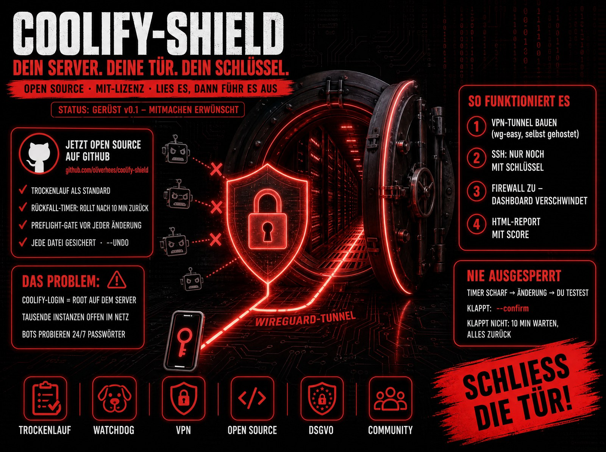
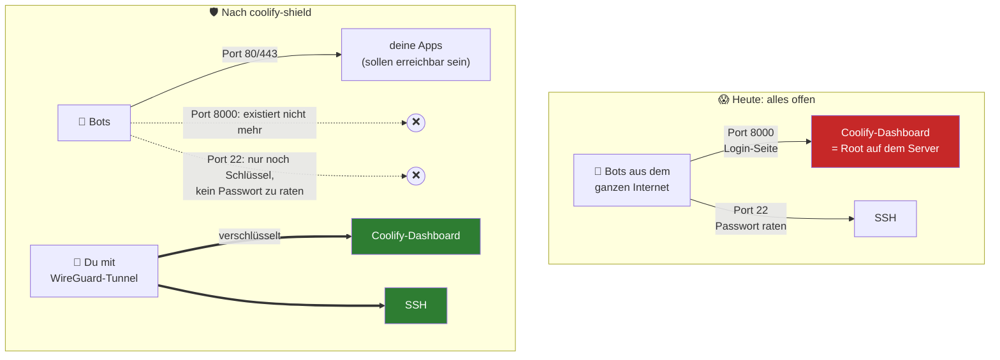
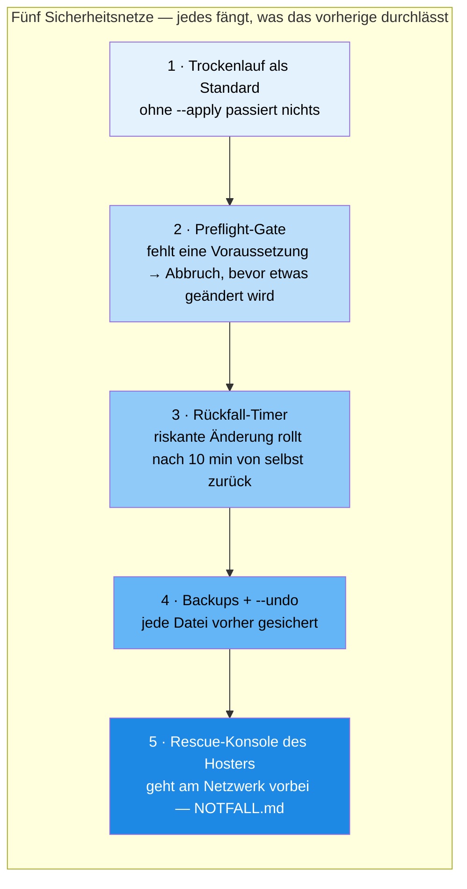
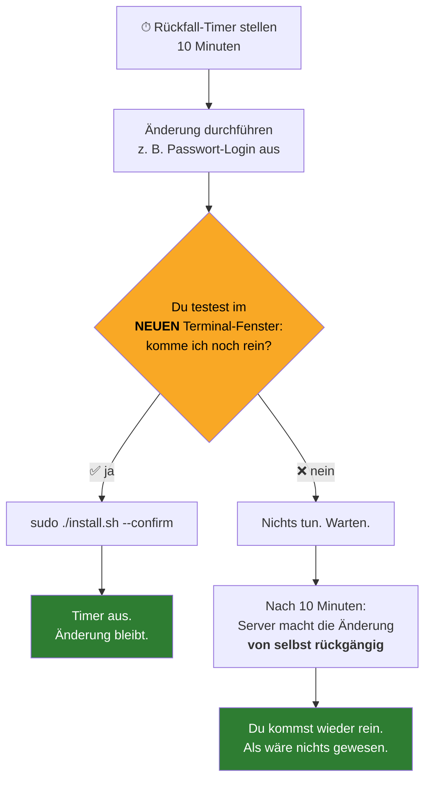
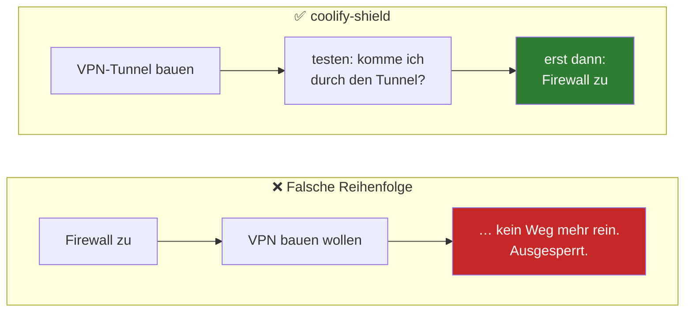

<div align="center">

**🚧 STATUS: v0.2.0 · Anfänger-Weg gebaut, noch nicht auf Produktivsystemen getestet. Live-Durchlauf steht aus.**



# 🛡️ COOLIFY-SHIELD

**Härtet deinen Coolify-Server ab — ohne dass du dich dabei aussperrst.**

[](LICENSE)
[](#-status)
[](https://github.com/oliverhees/coolify-shield/actions/workflows/shellcheck.yml)
[](#-architektur)
[](#warum-wireguard-und-nicht-tailscale)
[](https://aiianer.de)

*Ein Befehl auf deinem Laptop. Der Rest wird erklärt. Vor jedem riskanten Schritt ein Rückfall-Timer, der alles von selbst zurückrollt, wenn du nicht mehr reinkommst.*

[**Für Anfänger: hier starten**](ANFAENGER.md) · [Quickstart](#-quickstart) · [Sicherheitsnetz](#️-das-sicherheitsnetz) · [Architektur](#-architektur) · [Ich bin ausgesperrt](NOTFALL.md) · [Entstehung](docs/ENTSTEHUNG.md) · [Lizenz](#-lizenz)

</div>

---

## Inhaltsverzeichnis

- [👉 Noch nie einen Server verwaltet? → ANFAENGER.md](ANFAENGER.md)
- [Warum coolify-shield](#warum-coolify-shield)
- [Was uns unterscheidet](#-was-uns-unterscheidet)
- [Features](#-features)
- [Quickstart](#-quickstart)
- [Befehle](#-befehle)
- [Das Sicherheitsnetz](#️-das-sicherheitsnetz)
  - [Trockenlauf als Standard](#1-trockenlauf-als-standard)
  - [Rückfall-Timer (Watchdog)](#2-rückfall-timer-watchdog)
  - [Preflight-Gate](#3-preflight-gate)
  - [Backups und `--undo`](#4-backups-und---undo)
  - [Idempotenz](#5-idempotenz)
- [Architektur](#-architektur)
- [Ablauf der Phasen](#-ablauf-der-phasen)
- [Was das Script bewusst nicht kann](#-was-das-script-bewusst-nicht-kann)
- [Warum WireGuard und nicht Tailscale](#warum-wireguard-und-nicht-tailscale)
- [Unterstützte Systeme](#-unterstützte-systeme)
- [Ehrliche Einordnung (bitte lesen)](#️-ehrliche-einordnung-bitte-lesen)
- [Ich habe mich ausgesperrt](#-ich-habe-mich-ausgesperrt)
- [Status](#-status)
- [Roadmap](#️-roadmap)
- [Der Kurs dazu](#-der-kurs-dazu)
- [Mitmachen](#-mitmachen)
- [Das AIIANER-Universum](#-das-aiianer-universum)
- [Lizenz](#-lizenz)
- [Sicherheit](#-sicherheit)
- [Marken](#-marken)

---

## Warum coolify-shield

Wer sich in dein Coolify-Dashboard einloggt, hat **Root auf deinem Server** — im Dashboard steckt ein Terminal. Trotzdem hängen tausende Instanzen mit Passwortlogin und offenen Ports 8000/6001/6002 direkt im Netz.

Die Anleitungen dafür gibt es längst. Das eigentliche Problem ist die **Reihenfolge**: Firewall zu, bevor der SSH-Key läuft — und du stehst vor deinem eigenen Server. Die häufigste Coolify-Katastrophe ist nicht der Hacker, sondern der Admin, der sich selbst ausgesperrt hat.

coolify-shield ist ein Bash-Wizard, der genau das verhindert. Er ist für Leute gebaut, die **keine** Linux-Admins sind: Er fragt im Klartext, die sicherste Antwort ist der Default, Enter drücken reicht. Und bevor er irgendetwas Riskantes tut, macht er einen Timer scharf, der die Änderung von selbst zurücknimmt, falls du nicht bestätigst, dass du noch reinkommst.



## 🏆 Was uns unterscheidet

| | Manuelle Anleitung / Blogpost | Klassisches Hardening-Script | coolify-shield |
| --- | --- | --- | --- |
| **Aussperr-Schutz** | ❌ „Zweites Terminal offen lassen" als Fußnote | ❌ Meist keiner — läuft durch und hofft | ✅ [Rückfall-Timer](#2-rückfall-timer-watchdog) vor jedem riskanten Schritt, rollt nach 10 Minuten automatisch zurück |
| **Erst zeigen, dann machen** | — | ❌ Ändert sofort | ✅ Trockenlauf ist der **Standard**, ohne `--apply` passiert nichts |
| **Coolify-spezifisch** | Unterschiedlich | ❌ Generisches SSH/ufw, kennt 8000/6001/6002 nicht | ✅ Coolify-Ports in der Docker-Chain (DOCKER-USER) gesperrt, Web-Terminal-Erkennung, Root-Login via `prohibit-password` (Coolify braucht Root-SSH zu sich selbst), fail2ban lässt das Docker-Netz in Ruhe |
| **Läuft im Coolify-Web-Terminal?** | — | ❌ Sperrt die eigene Sitzung aus | ✅ Preflight erkennt das und bricht ab |
| **Rückgängig machen** | ❌ Von Hand | ❌ Selten | ✅ Jede Datei wird vor Änderung mit Zeitstempel gesichert, `--undo` holt alles zurück |
| **Mehrfach ausführbar** | — | ❌ Oft nicht | ✅ Idempotent — erledigte Schritte werden übersprungen |
| **Mehr als Debian/Ubuntu** | Meist nur Ubuntu | Meist nur Ubuntu | ✅ Abstraktion für apt/dnf/zypper/pacman und ufw/firewalld |
| **VPN ohne Drittanbieter** | Meist Tailscale | Meist Tailscale | ✅ Reines WireGuard auf dem eigenen Server, zwei Client-Dateien (Laptop, Handy), kein Auftragsverarbeitungsvertrag nötig |
| **Frischer Server** | „Erst mal Coolify installieren, dann …" | ❌ Setzt fertiges Coolify voraus | ✅ `--setup` nimmt den leeren Hetzner-Server und macht alles der Reihe nach, vom Laptop aus gesteuert |
| **Support-Fall** | „Was hast du gemacht?" | „Was hast du gemacht?" | ✅ `/var/log/coolify-shield.log` mit jedem Schritt und Zeitstempel + [NOTFALL.md](NOTFALL.md) pro Hoster |

## ✨ Features

- **Ein Befehl auf dem Laptop, keine Config-Datei.** `start.sh` (Mac/Linux) oder `start.ps1` (Windows) legt den Schlüssel an, führt durch die Hetzner-Bestellung, lädt den Server-Teil hoch und startet ihn. Das Script fragt, statt zu erwarten. Kein Ansible, keine Control-Machine, kein Inventory.
- **Geführter Ablauf (`--setup`).** Nach jeder Phase steht da „✓ Erledigt / ▶ Als Nächstes / ⏸ Du musst jetzt". Bricht der Lauf ab, startest du einfach neu; erledigte Phasen werden übersprungen.
- **Trockenlauf als Standard** für Server, auf denen Coolify schon läuft. `sudo ./install.sh` zeigt nur an. Erst `--apply` ändert etwas.
- **Watchdog vor jedem riskanten Schritt.** SSH-Härtung und Firewall laufen immer mit Rückfall-Timer (systemd-run, Fallback `at`). Im geführten Weg testet das Laptop-Script von außen und bestätigt selbst.
- **Preflight-Gate.** Root, Distro-Tier, systemd, Watchdog-Fähigkeit, Docker, laufender Coolify-Container, SSH-Sitzung (nicht Web-Terminal), hinterlegte SSH-Keys, Internet, freier Speicher — alles geprüft, bevor eine Zeile geändert wird.
- **Bestandsaufnahme (`--audit`).** 9 Prüfpunkte, nur lesen: SSH-Passwortlogin, Root-Login, Firewall, Coolify-Ports öffentlich?, Brute-Force-Schutz, Auto-Updates, VPN — plus die drei Punkte, die nur du selbst prüfen kannst.
- **Backups + `--undo`.** Jede angefasste Datei landet mit Zeitstempel unter `/var/backups/coolify-shield/`.
- **Idempotent.** Zustand unter `/var/lib/coolify-shield/`, erledigte Phasen werden übersprungen.
- **Distro-Abstraktion.** Debian-Familie, RHEL-Familie, SUSE, Arch — Paketmanager und Firewall-Werkzeug werden erkannt, nie direkt `apt-get` in den Phasen.
- **HTML-Report mit Ampel und Score.** Grün/Gelb/Rot, plus Restliste der Dinge, die kein Script für dich klicken kann.
- **Kurs-Verweise.** Nach jeder Phase ein Hinweis, wo es im Kurs weitergeht (`--no-cues` blendet sie aus).
- **Ein klarer Satz statt Stacktrace.** Jeder Abbruch sagt, *was* fehlt und *was zu tun ist*.

## 🚀 Quickstart

> **Anfänger?** Lies zuerst [ANFAENGER.md](ANFAENGER.md), dort wird jeder Schritt und jeder Begriff von Null erklärt.

Du brauchst: einen Laptop, ein Hetzner-Konto (oder die Bereitschaft, eins anzulegen) und etwa 30 Minuten. Einen Server brauchst du noch nicht, der wird unterwegs bestellt.

**Mac und Linux** (Terminal öffnen, einfügen, Enter):

```bash
curl -fsSL https://raw.githubusercontent.com/oliverhees/coolify-shield/main/start.sh -o start.sh && bash start.sh
```

**Windows** (PowerShell öffnen, einfügen, Enter):

```powershell
irm https://raw.githubusercontent.com/oliverhees/coolify-shield/main/start.ps1 -OutFile start.ps1; .\start.ps1
```

**Was dann passiert:**

1. Das Script legt einen SSH-Schlüssel an und kopiert den öffentlichen Teil in die Zwischenablage.
2. Du bestellst bei Hetzner einen Server. Das Script sagt dir, wo du klickst und was du einträgst.
3. Es testet den Login und lädt den Server-Teil hoch.
4. Der Server richtet sich selbst ein: Updates, Coolify, dein Coolify-Account, ein eigener Benutzer statt root, WireGuard, SSH nur noch per Schlüssel, Firewall. Nach jedem riskanten Schritt prüft das Laptop-Script von außen und bestätigt.
5. Du schaltest im Dashboard die Registrierung aus und 2FA an. Das Script prüft in der Coolify-Datenbank, ob es geklappt hat.
6. Das Script richtet WireGuard auf deinem Laptop ein und testet, ob das Dashboard durch den Tunnel antwortet.

Abgebrochen, Netz weg, Laptop zugeklappt? Einfach nochmal starten. Das Script merkt sich pro Server, wo es war.

### Server läuft schon mit Coolify?

Dann brauchst du nur den Server-Teil. Per SSH auf den Server, dann:

```bash
# 1. Holen
git clone https://github.com/oliverhees/coolify-shield.git
cd coolify-shield

# 2. Rescue-Konsole deines Hosters in einem Browser-Tab öffnen (siehe NOTFALL.md)

# 3. Trockenlauf: es passiert nichts, du siehst nur, was passieren würde
sudo ./install.sh

# 4. Wenn es passt: wirklich ausführen
sudo ./install.sh --apply

# 5. ZWEITES Terminal öffnen, neu einloggen. Klappt es?
sudo ./install.sh --confirm
#    Klappt es nicht: nichts tun. Nach 10 Minuten rollt es sich selbst zurück.
```

Dieser Weg legt keinen Coolify-Account und keinen Admin-Benutzer an, das hast du ja schon. Er baut den WireGuard-Tunnel, härtet SSH und schaltet die Firewall scharf. Die Client-Dateien liegen danach unter `/var/lib/coolify-shield/wireguard/`.

> **Nicht im Coolify-Web-Terminal ausführen.** Per SSH auf den Server. Das Preflight-Gate bricht sonst ab, mit Absicht: Firewall-Änderungen würden deine eigene Sitzung kappen.

## 🧭 Befehle

| Befehl | Was passiert |
| --- | --- |
| `sudo ./install.sh --setup` | der geführte Weg, macht alles der Reihe nach (Updates, Coolify, Account, Benutzer, WireGuard, Grundschutz, SSH, Firewall, Coolify-Einstellungen). Wird normalerweise vom Laptop-Script gestartet |
| `sudo ./install.sh` | Trockenlauf — zeigt nur an (Standard) |
| `sudo ./install.sh --apply` | führt aus |
| `sudo ./install.sh --audit` | prüft und schreibt Report, ändert nichts |
| `sudo ./install.sh --confirm` | bestätigt: „ich komme noch rein" — entschärft alle Rückfall-Timer |
| `sudo ./install.sh --undo` | rollt alles zurück |
| `sudo ./install.sh --status` | Zustand, abgeschlossene Phasen, laufende Timer |
| `--phase <basics\|ssh\|firewall\|vpn>` | nur eine Phase |
| `--yes` | keine Rückfragen (nur für Wiederholungsläufe) |
| `--force` | auf ungetesteten Systemen trotzdem starten |
| `--no-cues` | Kurs-Verweise ausblenden |

## 🛡️ Das Sicherheitsnetz

Fünf Mechanismen, die zusammen dafür sorgen, dass ein Anfänger dieses Script laufen lassen kann, ohne sich den Server kaputtzumachen.



### 1. Trockenlauf als Standard

`DRY_RUN=1` ist der Ausgangszustand. Jeder ändernde Befehl läuft durch einen `run`-Wrapper, der im Trockenlauf nur `[trocken] <befehl>` ausgibt. Erst `--apply` setzt `DRY_RUN=0`.

### 2. Rückfall-Timer (Watchdog)

Das Herzstück — das Muster von `reload in 10` bei Cisco-Switches:



Umgesetzt mit `systemd-run --on-active`, Fallback auf `at`. Gibt es keinen von beiden, **wird nichts Riskantes geändert** — das Preflight-Gate bricht ab. Der Watchdog wird immer *vor* der Änderung scharf gemacht, nie danach.

### 3. Preflight-Gate

Phase 0 ändert nichts und bricht mit genau einem klaren Satz ab, wenn etwas fehlt:

| Prüfung | Bei Fehlschlag |
| --- | --- |
| Root-Rechte | Abbruch |
| Distro erkannt (Tier 1/2) | Tier 0 nur mit `--force` |
| Watchdog möglich (systemd-run oder `at`) | Abbruch — ohne Timer kein Risiko |
| Docker + laufender `coolify`-Container | Abbruch (`--force` überspringt). Im `--setup`-Weg nur ein Hinweis, Coolify kommt dort erst in Phase 2 |
| Sitzungsart (SSH von außen, lokale Konsole oder Coolify-Web-Terminal) | **Abbruch** im Web-Terminal — erkannt an der Prozesskette und der Quell-IP, nicht nur an `$SSH_CONNECTION` (die wirft `sudo` weg) |
| Mindestens ein SSH-Key hinterlegt | Warnung, SSH-Phase wird übersprungen |
| Internet, ≥ 1 GB frei | Warnung |
| Rescue-Konsole offen? (Rückfrage) | Abbruch — zu Recht |

### 4. Backups und `--undo`

`backup_file` sichert jede Datei vor der ersten Änderung nach `/var/backups/coolify-shield/<zeitstempel>_<pfad>`. `--undo` entschärft alle Timer, entfernt das SSH-Drop-in (Passwort-Login wieder erlaubt), schaltet ufw ab und räumt die Docker-Regeln weg. WireGuard wird nur auf Nachfrage entfernt, weil damit die Handy- und Laptop-Zugänge ungültig werden. Nicht zurückgenommen, weil harmlos: Updates, fail2ban, Coolify, dein Benutzer.

### 5. Idempotenz

Jede abgeschlossene Phase schreibt einen Marker nach `/var/lib/coolify-shield/`. Beim nächsten Lauf: „übersprungen — läuft bereits". Wichtig für den geführten Weg, weil das Laptop-Script den Server-Teil nach jedem Neustart und nach jedem Rückfall-Timer erneut aufruft. Und wichtig nach einem Coolify-Update, falls Docker seine Regeln neu lädt: einfach nochmal laufen lassen. WireGuard-Schlüssel werden dabei nie neu erzeugt, sonst wären Handy und Laptop draußen.

## 🧩 Architektur

```
coolify-shield/
├── start.sh                ← Laptop-Wizard für Mac und Linux: Schlüssel, Hetzner, Login,
│                             Server-Teil starten, von außen prüfen, Tunnel auf dem Laptop
├── start.ps1               ← dasselbe für Windows (PowerShell)
├── install.sh              ← Server-Teil: Argument-Parsing, Modi, Phasen-Reihenfolge
├── lib/
│   ├── 00-common.sh        Fundament: Logging, Fragen, run/Dry-Run, Backups, Zustand,
│   │                       Distro-Erkennung, pkg_install, WATCHDOG, next_up, laptop.env
│   ├── 00-preflight.sh     Phase 0 · Gate — darf das hier überhaupt laufen?
│   ├── 05-updates.sh       Phase 1 · Updates, Grundpakete, Zeit, Swap (nur --setup)
│   ├── 10-audit.sh         Bestandsaufnahme, nur lesen
│   ├── 15-coolify.sh       Phase 2 · Coolify installieren, Phase 3 · Account anlegen (nur --setup)
│   ├── 20-basics.sh        Phase 6 · risikofrei (Auto-Updates, fail2ban, Logrotation)
│   ├── 25-adminuser.sh     Phase 4 · eigener Benutzer mit sudo statt root (nur --setup)
│   ├── 30-ssh.sh           Phase 7 · SSH härten — mit Watchdog
│   ├── 40-firewall.sh      Phase 8 · ufw + DOCKER-USER — mit Watchdog
│   ├── 50-wireguard.sh     Phase 5 · reines WireGuard, zwei Client-Configs, QR im Terminal
│   ├── 60-coolify-secure.sh Phase 9 · Registrierung aus + 2FA prüfen (nur --setup)
│   └── 99-report.sh        Report mit Score
├── ANFAENGER.md            ← für Einsteiger: alles von Null erklärt
├── NOTFALL.md              ← die wichtigste Datei im Repo
├── docs/ENTSTEHUNG.md      der Chat, aus dem das Projekt hervorging
└── .github/workflows/      shellcheck bei jedem Push
```

**Pfade auf dem Server:**

| Pfad | Inhalt |
| --- | --- |
| `/var/log/coolify-shield.log` | jeder Schritt mit Zeitstempel — im Supportfall: „schick mir die Datei" |
| `/var/lib/coolify-shield/` | Zustand (erledigte Phasen, aktive Watchdogs) |
| `/var/lib/coolify-shield/laptop.env` | was der Server dem Laptop-Script mitteilt: aktuelle Phase, Admin-Benutzer, Neustart nötig, laufender Timer |
| `/var/lib/coolify-shield/wireguard/` | `laptop.conf` und `handy.conf`, die beiden Client-Dateien |
| `/var/backups/coolify-shield/` | Sicherungen geänderter Dateien |
| `/root/coolify-shield-report.html` | der Report |
| `/etc/ssh/sshd_config.d/00-coolify-shield.conf` | SSH-Drop-in (nur Schlüssel, root nur per Schlüssel) |
| `/etc/ufw/after.rules` | enthält den Block `# BEGIN coolify-shield … # END coolify-shield` mit den Docker-Regeln |
| `/etc/wireguard/wg0.conf` | Server-Seite des Tunnels |
| `/opt/coolify-shield/` | dort legt das Laptop-Script den Server-Teil ab |

**Pfade auf dem Laptop:**

| Pfad | Inhalt |
| --- | --- |
| `~/.ssh/coolify-shield/<name>` | dein Schlüsselpaar |
| `~/.ssh/config` | ein `Host <name>`-Block, damit `ssh <name>` reicht |
| `~/.coolify-shield/<name>.env` | Merkzettel des Laptop-Scripts: IP, Benutzer |
| `~/.coolify-shield/<name>-laptop.conf` | deine WireGuard-Datei |

## 🔁 Ablauf der Phasen

Der geführte Weg (`--setup`) läuft in dieser Reihenfolge. Das Laptop-Script ruft den Server-Teil so oft auf, bis `phase=done` in `laptop.env` steht. Nach einem Neustart und nach jedem Rückfall-Timer geht die Kontrolle kurz zurück an den Laptop.

```mermaid
flowchart TD
    L1["Laptop · Schlüssel anlegen"] --> L2["Laptop · Hetzner bestellen<br/>(Anleitung, du klickst)"]
    L2 --> L3["Laptop · Login testen,<br/>Server-Teil hochladen"]
    L3 --> P0["Server 0 · Preflight"]
    P0 --> P1["Server 1 · Updates, Swap, Zeit<br/>ggf. Neustart"]
    P1 --> P2["Server 2 · Coolify installieren"]
    P2 --> P3["Server 3 · Coolify-Account<br/>👆 du registrierst dich"]
    P3 --> P4["Server 4 · eigener Benutzer<br/>statt root"]
    P4 --> P5["Server 5 · WireGuard<br/>QR fürs Handy"]
    P5 --> P6["Server 6 · Grundschutz<br/>Auto-Updates · fail2ban"]
    P6 --> P7["Server 7 · SSH nur Schlüssel<br/>⏱ Laptop prüft und bestätigt"]
    P7 --> P8["Server 8 · Firewall<br/>⏱ Laptop prüft und bestätigt"]
    P8 --> P9["Server 9 · Registrierung aus, 2FA an<br/>👆 du klickst, Script prüft in der DB"]
    P9 --> R["Server · Bestandsaufnahme + Report"]
    R --> L5["Laptop · WireGuard einrichten,<br/>Dashboard durch den Tunnel testen"]
    style L1 fill:#455a64,color:#fff
    style L2 fill:#455a64,color:#fff
    style L3 fill:#455a64,color:#fff
    style L5 fill:#455a64,color:#fff
    style P0 fill:#607d8b,color:#fff
    style P1 fill:#2e7d32,color:#fff
    style P2 fill:#2e7d32,color:#fff
    style P3 fill:#f9a825,color:#000
    style P4 fill:#2e7d32,color:#fff
    style P5 fill:#2e7d32,color:#fff
    style P6 fill:#2e7d32,color:#fff
    style P7 fill:#ef6c00,color:#fff
    style P8 fill:#ef6c00,color:#fff
    style P9 fill:#f9a825,color:#000
    style R fill:#1565c0,color:#fff
```



| Phase | Modul | Was passiert | Rückfall-Timer | Was du tun musst |
| --- | --- | --- | --- | --- |
| **Laptop 1 · Schlüssel** | `start.sh` / `start.ps1` | ed25519-Schlüssel unter `~/.ssh/coolify-shield/<name>`, Block in `~/.ssh/config` (`IdentitiesOnly yes`), öffentlicher Teil in die Zwischenablage | nein | Servernamen wählen, optional Passphrase |
| **Laptop 2 · Hetzner** | `start.sh` / `start.ps1` | zeigt die Bestell-Anleitung (Ubuntu 24.04, 4 GB, Schlüssel anhaken, Rescue-Konsole öffnen) | nein | bestellen, IP eintragen |
| **Laptop 3 · Login** | `start.sh` / `start.ps1` | wartet bis SSH antwortet, lädt das Repo als Tarball nach `/opt/coolify-shield`, startet `install.sh --setup` | nein | nichts |
| **0 · Preflight** | `00-preflight.sh` | prüft Root, Distro, Watchdog-Fähigkeit, Sitzungsart, Internet, Platz. Ändert nichts | nein | bestätigen, dass die Rescue-Konsole offen ist |
| **1 · Updates** | `05-updates.sh` | `apt upgrade`, Grundpakete (ufw, fail2ban, wireguard-tools, qrencode), Zeitzone Europe/Berlin, 2 GB Swap. Braucht der Kernel einen Neustart, endet das Script mit Code 75, der Laptop startet den Server neu und macht weiter | nein | nichts, bei Neustart etwa eine Minute warten |
| **2 · Coolify** | `15-coolify.sh` | offizieller Coolify-Installer, wartet bis Port 8000 antwortet | nein | nichts |
| **3 · Account** | `15-coolify.sh` | zeigt `http://<ip>:8000`, wartet und zählt in der Coolify-DB die Nutzer. Sofort nach der Installation, weil der erste Account der Admin ist | nein | im Browser registrieren, langes Passwort, dann Enter |
| **4 · Benutzer** | `25-adminuser.sh` | eigener Benutzer mit `sudo` ohne Passwort, Docker-Gruppe, übernimmt den Schlüssel von root. Der Laptop loggt sich ab jetzt als dieser Benutzer ein | nein | Benutzernamen wählen |
| **5 · WireGuard** | `50-wireguard.sh` | `wg0` mit `10.8.0.1/24` auf UDP 51820, zwei Client-Dateien (Laptop `10.8.0.2`, Handy `10.8.0.3`) als Split-Tunnel, QR-Code fürs Handy im Terminal | nein (kappt keinen Zugang) | Handy-QR scannen, jetzt oder später |
| **6 · Grundschutz** | `20-basics.sh` | unattended-upgrades, fail2ban (5 Fehlversuche, 1 h Sperre, Docker-Netz und Tunnel ausgenommen), Logrotation | nein | nichts |
| **7 · SSH** | `30-ssh.sh` | Drop-in `00-coolify-shield.conf`: `PasswordAuthentication no`, `PermitRootLogin prohibit-password`, `MaxAuthTries 3`. `sshd -t` vor dem Reload, `sshd -T` danach. Wird übersprungen, wenn kein Schlüssel hinterlegt ist | **ja, 10 min**. Der Laptop testet Login mit Schlüssel und ohne, bestätigt mit `--confirm` | nichts |
| **8 · Firewall** | `40-firewall.sh` | ufw: 22, 80, 443, 51820/udp offen, alles aus `wg0` offen. Zusätzlich ein Block in `DOCKER-USER`: 8000/6001/6002 nur aus dem Tunnel und aus privaten Netzen, aus dem Internet DROP. **SSH Port 22 bleibt aus dem Internet erreichbar**, geschützt durch Schlüsselpflicht und fail2ban | **ja, 10 min**. Der Laptop testet SSH und ob Port 8000 von außen zu ist (IPv4 und IPv6), bestätigt mit `--confirm` | nichts |
| **Bestandsaufnahme** | `10-audit.sh` | 9 Prüfpunkte, nur lesen | nein | nichts |
| **9 · Coolify absichern** | `60-coolify-secure.sh` | zeigt die Klickwege, liest danach `is_registration_enabled` und `two_factor_confirmed_at` aus der Coolify-DB. Drei Versuche, dann geht es weiter und der Punkt bleibt im Report offen | nein | Tunnel an, im Dashboard Registrierung aus und 2FA an |
| **Report** | `99-report.sh` | HTML mit Ampel, Score und Restliste | nein | nichts |
| **Laptop 5 · Tunnel** | `start.sh` / `start.ps1` | holt `laptop.conf`, importiert sie (Mac: WireGuard-App, Linux: NetworkManager oder `wg-quick`), testet `http://10.8.0.1:8000` | nein | Mac: Tunnel in der App importieren und aktivieren |

**Warum SSH offen bleibt:** Wäre Port 22 nur aus dem Tunnel erreichbar, dann würde ein kaputter Tunnel dich vom Server aussperren, und genau das soll das Script verhindern. Ein SSH-Dienst, der nur Schlüssel akzeptiert und nach drei Versuchen dichtmacht, ist für Bots kein Ziel. Wer es strenger will, kann bei Hetzner zusätzlich eine Cloud-Firewall vor Port 22 setzen.

**Warum Docker eine eigene Regel braucht:** Docker schreibt seine Port-Freigaben direkt in iptables und umgeht damit ufw. Ein `ufw deny 8000` allein ändert nichts. Deshalb landet der Block in der Chain `DOCKER-USER`, die Docker absichtlich für genau solche Regeln frei lässt, und matcht über `ctorigdstport`, weil Docker die Zieladresse vorher umschreibt.

**Die Reihenfolge ist nicht verhandelbar:** WireGuard läuft *vor* SSH und Firewall. Sonst macht die Firewall das Dashboard zu, bevor der Tunnel existiert — der klassische Aussperr-Fehler.



**So sieht die Firewall danach aus:**

| Port | Regel | Umgesetzt in |
| --- | --- | --- |
| 22/tcp | von überall, aber nur mit Schlüssel (fail2ban sperrt nach 5 Fehlversuchen) | ufw |
| 80, 443/tcp | von überall — deine Apps + Let's Encrypt | ufw |
| 51820/udp | von überall — WireGuard-Einwahl | ufw |
| alles auf `wg0` | aus dem Tunnel alles erlaubt | ufw |
| 8000, 6001, 6002/tcp | nur aus dem Tunnel (`10.8.0.0/24`) und aus privaten Netzen, aus dem Internet DROP mit Log | `DOCKER-USER` in `/etc/ufw/after.rules` |
| alles andere | zu | ufw |

## 🚫 Was das Script bewusst nicht kann

Ein paar Dinge macht das Script mit Absicht nicht selbst. Es sagt dir, was zu tun ist, und prüft hinterher, ob es passiert ist.

- **Registrierung abschalten und 2FA aktivieren.** Beides steckt in Coolifys eigener Datenbank. Da schreibt ein fremdes Script nicht rein: an der DB eines fremden Servers herumzuschreiben ist bei einem Tool für Hunderte Nutzer ein No-Go. Das Script **liest** aber nach: `is_registration_enabled` in `instance_settings` und `two_factor_confirmed_at` bei den Nutzern. Ist nach drei Anläufen noch etwas offen, geht es weiter und der Punkt steht im Report.
  - Registrierung: Settings → Registration Allowed → aus → Save.
  - 2FA: Profil → Two-factor Authentication → Enable → QR scannen → Code eingeben. Wiederherstellungscodes in den Passwort-Manager, nicht auf den Server und nicht auf dasselbe Handy wie die Authenticator-App.
- **Den Coolify-Account anlegen.** Der erste registrierte Nutzer ist der Admin. Das Script zeigt dir die Adresse und wartet, bis in der Datenbank ein Nutzer steht. Nimm ein Passwort mit 25+ Zeichen aus dem Manager, es ist faktisch dein Root-Passwort.
- **Den Hetzner-Server bestellen.** Das Laptop-Script zeigt eine Anleitung (Image, Größe, Schlüssel anhaken, Rescue-Konsole öffnen) und fragt danach die IP ab. Es nutzt keine Hetzner-API und braucht keinen API-Token. Andere Hoster gehen auch, die Anleitung passt dann nur nicht eins zu eins.
- **Den Tunnel auf dem Mac aktivieren.** Auf Linux importiert das Script die Datei selbst (NetworkManager oder `wg-quick`). Auf dem Mac öffnet es die WireGuard-App, importieren und einschalten musst du selbst.
- **Den Handy-QR scannen.** Der Code steht im Terminal und lässt sich jederzeit wieder anzeigen: `sudo qrencode -t ansiutf8 < /var/lib/coolify-shield/wireguard/handy.conf`.

Das sind zusammen ein paar Minuten Klickarbeit. Zusammen mit fail2ban und der Schlüsselpflicht erledigt das schon rund 90 % der Bot-Angriffe.

## Warum WireGuard und nicht Tailscale

WireGuard läuft komplett auf deinem Server, als Kernel-Modul, ohne Container. Kein Drittanbieter in der Steuerungsebene, keine Daten bei einem US-Anbieter, kein Auftragsverarbeitungsvertrag nötig. Auf dem Handy: offizielle WireGuard-App, QR-Code scannen, ein Tap zum Verbinden. Auf dem Laptop richtet das Start-Script den Tunnel ein.

**Und warum kein wg-easy?** wg-easy ist WireGuard mit einer Weboberfläche. Die Oberfläche ist ein zweites Web-Login mit eigenem Passwort, das du dir merken, absichern und aus dem Internet fernhalten musst. Für Anfänger ist das eine Hürde mehr und für alle eine Angriffsfläche mehr. Das Script erzeugt stattdessen genau zwei Client-Dateien, eine für den Laptop und eine für das Handy. Mehr braucht es für ein Dashboard nicht. Willst du später ein drittes Gerät, ist das ein weiterer `[Peer]`-Block in `/etc/wireguard/wg0.conf`, kein Web-Panel.

Wer Tailscale bevorzugt, aber die Steuerungsebene selbst hosten will: **Headscale** — gleiche Clients, eigener Koordinationsserver. Cloudflare Access hat dasselbe Problem wie Tailscale (US-Anbieter, TLS-Terminierung bei Cloudflare) und fällt für DSGVO-sensible Setups ebenfalls raus.

**Und warum kein Forward-Auth (Authentik/Authelia) vor dem Dashboard?** Coolify generiert seine Traefik-Router selbst, Realtime/Terminal laufen über eigene Router (6001/6002), und beim nächsten Update kann die Anpassung überschrieben werden. Authentik ist großartig für deine *deployten Apps* — für das Dashboard selbst ist VPN der verlässlichere Weg.

## 💻 Unterstützte Systeme

| Tier | Systeme | Verhalten |
| --- | --- | --- |
| **1 — getestet** | Ubuntu 22.04 / 24.04 / 26.04, Debian 12 / 13 | läuft |
| **2 — sollte laufen** | Raspberry Pi OS, Fedora, Rocky, Alma, openSUSE, Arch/Manjaro | läuft mit Warnung |
| **0 — unbekannt** | alles andere | nur mit `--force` |

| Familie | Paketmanager | Firewall |
| --- | --- | --- |
| Debian | `apt` | `ufw` |
| RHEL | `dnf` | `firewalld` |
| SUSE | `zypper` | `firewalld` |
| Arch | `pacman` | `ufw` |

Voraussetzung: systemd (für den Watchdog) — ohne systemd Fallback auf das Paket `at`. Arch bekommt bewusst **keine** automatischen Updates (Rolling Release).

## ⚠️ Ehrliche Einordnung (bitte lesen)

- **Das ist ungetestet.** Alle Phasen sind ausprogrammiert, shellcheck ist grün, der Trockenlauf läuft durch. Ein Durchlauf auf einem echten Hetzner-Server mit echtem Coolify, vom Laptop bis zum Dashboard im Tunnel, steht noch aus. Wer es heute ausprobiert, tut das bitte auf einem frischen Server, den er notfalls löschen kann, und postet die Ausgabe in der Community.
- **Docker umgeht ufw.** Docker schreibt eigene iptables-Regeln. Die Host-Firewall schützt den Host, nicht die von Containern veröffentlichten Ports. Deshalb sperrt das Script die Coolify-Ports zusätzlich in der Chain `DOCKER-USER`. Ob das auf deinem System greift, siehst du an `iptables -S DOCKER-USER | grep 8000`; das Script prüft das selbst und der Laptop testet von außen. Eine Cloud-Firewall beim Hoster (Hetzner & Co.) bleibt trotzdem sinnvoll.
- **SSH bleibt aus dem Internet erreichbar.** Nur mit Schlüssel, mit fail2ban davor, aber erreichbar. Das ist eine bewusste Entscheidung gegen das Aussperren, keine Härtungslücke, die vergessen wurde. Siehe [Ablauf der Phasen](#-ablauf-der-phasen).
- **Ein Coolify-Update kann Docker-Regeln neu laden.** Docker legt seine Chains beim Start neu an; der Block in `after.rules` wird von ufw bei jedem Reload mitgeladen. Sollte nach einem Update Port 8000 wieder offen sein: `sudo ufw reload`, oder das Script nochmal laufen lassen. Es ist idempotent.
- **Der Neustart in Phase 1 ist ein Bruch im Ablauf.** Das Script beendet sich mit Code 75 und setzt ein Flag; das Laptop-Script wartet und ruft neu auf. Läuft der Server-Teil ohne Laptop (`--setup` direkt per SSH gestartet), musst du nach dem Neustart selbst wieder `--setup` aufrufen.
- **Bestehende SSH-Verbindungen laufen weiter**, auch wenn neue blockiert sind. Wer im *alten* Fenster testet und `--confirm` drückt, ist ausgesperrt. Immer in einem **neuen** Fenster testen — darauf fallen 80 % der Fälle rein. Im geführten Weg macht der Laptop genau das: eine frische Verbindung von außen, nicht die laufende Sitzung.
- **Kein Ersatz für eine Sicherheitsberatung.** Das Script setzt bekannte Basismaßnahmen um. Es macht deinen Server nicht „unangreifbar".

## 🆘 Ich habe mich ausgesperrt

→ **[NOTFALL.md](NOTFALL.md)** — erst 12 Minuten warten (der Watchdog hat es meistens schon gelöst), dann Rescue-Konsole des Hosters: Hetzner Cloud/Robot, Netcup, Contabo, IONOS, Strato, DigitalOcean, Vultr, Linode, Scaleway sind beschrieben. Danach `--undo` oder die manuellen Einzelschritte.

## 🔧 Status

**v0.2.0 · Anfänger-Weg gebaut, noch nicht auf Produktivsystemen getestet. Live-Durchlauf steht aus.**

- [x] `start.sh` — Laptop-Wizard für Mac und Linux: Schlüssel, `~/.ssh/config`, Hetzner-Anleitung, Login-Test, Upload, Neustart-Behandlung, Prüfung von außen mit `--confirm`, WireGuard auf dem Laptop
- [x] `start.ps1` — dasselbe für Windows (entsteht parallel, siehe Quickstart)
- [x] `install.sh` — alle Modi (`--setup`, `--apply`, `--audit`, `--confirm`, `--undo`, `--status`, `--phase`, `--yes`, `--force`, `--no-cues`)
- [x] `00-common.sh` — Logging, Fragen mit sicherem Default, `run`-Dry-Run-Wrapper, `backup_file`, Zustandsspeicher, Distro-Erkennung, `pkg_install`, **Watchdog** (systemd-run mit `at`-Fallback), `next_up`, `laptop.env`
- [x] `00-preflight.sh` — komplettes Gate inkl. Web-Terminal-Erkennung und SSH-Key-Zählung, weiß im `--setup`-Weg, dass Coolify erst später kommt
- [x] `05-updates.sh` — Updates, Grundpakete, Zeitzone, Swap, Neustart-Flag
- [x] `10-audit.sh` — 9 Prüfpunkte, liest das System vollständig aus
- [x] `15-coolify.sh` — offizieller Installer, Warten auf Port 8000, Account-Prüfung in der DB
- [x] `20-basics.sh` — unattended-upgrades / dnf-automatic, fail2ban mit Docker-Ausnahme, Logrotation
- [x] `25-adminuser.sh` — eigener Benutzer, sudo ohne Passwort, Schlüssel von root übernommen
- [x] `30-ssh.sh` — Drop-in mit Vorrang, `sshd -t`, `reload` (nicht `restart`), `sshd -T`-Nachprüfung, Watchdog
- [x] `40-firewall.sh` — ufw-Zweig plus `DOCKER-USER`-Block, Selbsttest, Watchdog
- [x] `50-wireguard.sh` — reines WireGuard, Server- und zwei Client-Configs, QR im Terminal
- [x] `60-coolify-secure.sh` — Registrierung und 2FA in der Coolify-DB nachlesen
- [x] `--undo` — Timer, SSH-Drop-in, ufw, Docker-Regeln, WireGuard auf Nachfrage
- [x] `NOTFALL.md` — Rescue-Konsole pro Hoster, manuelle Rückbau-Schritte
- [x] shellcheck sauber (`-S warning`), Syntax geprüft, CI eingerichtet
- [ ] **Live-Durchlauf** auf einem frischen Hetzner-Server (Ubuntu 24.04) vom Laptop bis zum Dashboard im Tunnel
- [ ] firewalld-Zweig (RHEL/SUSE bekommen bisher nur eine Warnung in Phase 8)
- [ ] Report — vollständiges Template (schwarz/rot), Vorher/Nachher
- [ ] CrowdSec als Alternative zu fail2ban

## 🗺️ Roadmap

1. **Live-Test** des kompletten Anfänger-Wegs auf Ubuntu 24.04 bei Hetzner, dann Debian 12. Erst danach verschwindet der Hinweis oben.
2. **`start.ps1`** auf Windows 10 und 11 durchtesten (OpenSSH-Client, WireGuard für Windows).
3. **firewalld-Zweig** in `40-firewall.sh`, damit Tier 2 mehr als eine Warnung bekommt.
4. **HTML-Report** im AIIANER-Look mit Vorher/Nachher.
5. **Drittes Gerät** ohne Handarbeit: `--add-peer <name>` erzeugt eine weitere Client-Datei.
6. **CrowdSec** als Option in `20-basics.sh`.

## 🎓 Der Kurs dazu

Das Script ist öffentlich und bleibt es. Es härtet deinen Server — der Kurs in der [AIIANER-Community](https://aiianer.de) erklärt das **Warum**, plus VPN-Setup Schritt für Schritt, Multi-Server, Backups und Incident-Response. Script und Video laufen im Gleichschritt: nach jeder Phase sagt dir das Script, an welcher Stelle im Kurs es weitergeht.

Wer keinen Kurs braucht, braucht ihn nicht. Der Code ist vollständig hier.

## 🤝 Mitmachen

Pull Requests willkommen — besonders für Systeme aus Tier 2 und für die offenen Phasen. Siehe [CONTRIBUTING.md](CONTRIBUTING.md). `shellcheck -x -S warning install.sh lib/*.sh` muss grün sein, jede Phase muss im Trockenlauf sauber durchlaufen, und jeder riskante Schritt bekommt einen Watchdog. Kein direktes `apt-get` in den Phasen — immer über `pkg_install`.

Wenn du das Script auf einem Tier-2-System erfolgreich getestet hast: Issue mit `--audit`-Ausgabe und `/var/log/coolify-shield.log` — dann rückt das System in Tier 1.

Wie das Projekt entstanden ist und warum die Entscheidungen so gefallen sind: [docs/ENTSTEHUNG.md](docs/ENTSTEHUNG.md).

## 🌍 Das AIIANER-Universum

| | |
| --- | --- |
| 🏠 **Community** | [aiianer.de](https://aiianer.de) — Kurse, Labs, Tutorials, KI-Coaches |
| 📺 **YouTube** | [youtube.com/@aiianer](https://www.youtube.com/@aiianer) — Tools, Tests, Deep-Dives |
| 🛠️ **coolify-server-hardening** | [github.com/oliverhees/coolify-server-hardening](https://github.com/oliverhees/coolify-server-hardening) — One-Shot-Hardening für Hetzner-Server (der Vorgänger; coolify-shield ist die Version mit Rückfall-Timer, Anfänger-Weg und Laptop-Script) |
| 🔒 **Datenschleuse** | [github.com/oliverhees/datenschleuse](https://github.com/oliverhees/datenschleuse) — DSGVO-Filter für deine KI |
| 🧠 **Lokyy Brain** | [github.com/oliverhees/lokyy-brain](https://github.com/oliverhees/lokyy-brain) — dein Second Brain, selbst gehostet |
| 📡 **Sichtradar** | [sichtradar.de](https://sichtradar.de) — empfiehlt die KI dich oder deine Konkurrenz? |
| 🤖 **Lokyy** | [lokyy.de](https://lokyy.de) — KI-Apps & Werkzeuge |

## 📜 Lizenz

**[MIT](LICENSE)** — frei nutzbar, frei veränderbar, frei weitergebbar. Bei einem Werkzeug, das als root auf fremden Servern läuft, ist maximale Lesbarkeit und maximale Verbreitung wichtiger als Copyleft.

## 🔐 Sicherheit

Sicherheitslücken bitte **nicht** als öffentliches Issue melden. Verantwortungsvolle Meldung: siehe [SECURITY.md](SECURITY.md).

## ™️ Marken

„AIIANER", „Lokyy", „Lokyy Brain", „Datenschleuse" und „Sichtradar" sind Kennzeichen von Oliver Hees aka Aiianer. Die Lizenz des Quellcodes gewährt **keine** Rechte an diesen Namen oder Logos. Forks müssen unter eigenem Namen auftreten.

„Coolify" ist ein Open-Source-Projekt von **coollabs** ([github.com/coollabsio/coolify](https://github.com/coollabsio/coolify)). „WireGuard", „Traefik" und „CrowdSec" gehören ihren jeweiligen Projekten. coolify-shield ist ein unabhängiges Community-Projekt und steht in keiner offiziellen Verbindung zu coollabs.

---

<div align="center">

Made with 🛡️ für alle, die ihren Coolify-Server nicht offen im Netz hängen lassen wollen · [MIT](LICENSE)

Mit ❤️ und Leidenschaft von **Oliver Hees – Der Aiianer**
Community: **[aiianer.de](https://aiianer.de)**

</div>
